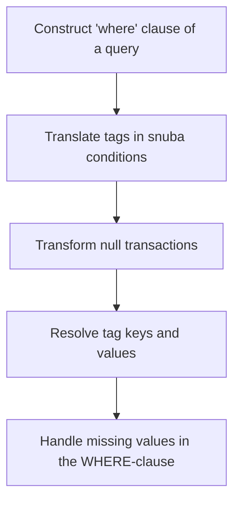

This document will cover the Query Building Process in Sentry, which includes:

1. Constructing the 'where' clause of a query
2. Translating tags in snuba conditions
3. Transforming null transactions
4. Resolving tag keys and values
5. Handling missing values in the WHERE-clause.

Technical document: <SwmLink doc-title="Understanding _build_where Function">[Understanding \_build_where Function](/.swm/understanding-_build_where-function.pc1e8ie7.sw.md)</SwmLink>

# Constructing the 'where' clause of a query

The 'where' clause of a query is constructed by creating a list of conditions that include the organization id and project id. Time frame conditions are then added to the list. If there are no additional conditions in the metrics query, the 'where' list is returned. Otherwise, each condition in the metrics query is processed. If the condition is a metric condition, where statements are generated and appended to the metric condition filters list. If not, the condition is appended to the snuba conditions list. Finally, the 'where' list is extended with the metric condition filters and resolved tags from the snuba conditions.

# Translating tags in snuba conditions

Tags in snuba conditions are translated. If the input is a list or tuple, each item is recursively resolved. If the input is a function, different cases are handled based on the function type. If the input is a condition, the left-hand side and right-hand side of the condition are resolved. If the input is a boolean condition, each condition in the input is resolved. If the input is a column, the column name is resolved. If the input is a string, the string is resolved as a tag value or a weak resolution based on the 'is_tag_value' flag. If the input is an integer, the input is simply returned.

# Transforming null transactions

Any null 'tag.transaction' is transformed to '<< unparameterized >>' so that it can be handled as such in any query using that tag value.

# Resolving tag keys and values

The tag key is resolved based on the use case id. If the use case id is 'PERFORMANCE', 'tags_raw\[resolved\]' is returned, otherwise 'tags\[resolved\]' is returned. The tag value is resolved based on the use case id. If the use case id is 'PERFORMANCE', the string is returned as is, otherwise the string is resolved.

# Handling missing values in the WHERE-clause

A version of 'resolve' that returns -1 for missing values is used. This is useful when producing a WHERE-clause, as it makes the WHERE-clause 'impossible' with 'WHERE x = -1' instead of explicitly handling that exception.

&nbsp;

*This is an auto-generated document by Swimm AI 🌊 and has not yet been verified by a human*

<SwmMeta version="3.0.0" repo-id="Z2l0aHViJTNBJTNBc2VudHJ5LWRlbW8lM0ElM0FTd2ltbS1EZW1v" repo-name="sentry-demo" doc-type="product-flows">Powered by [Swimm](/)</SwmMeta>
