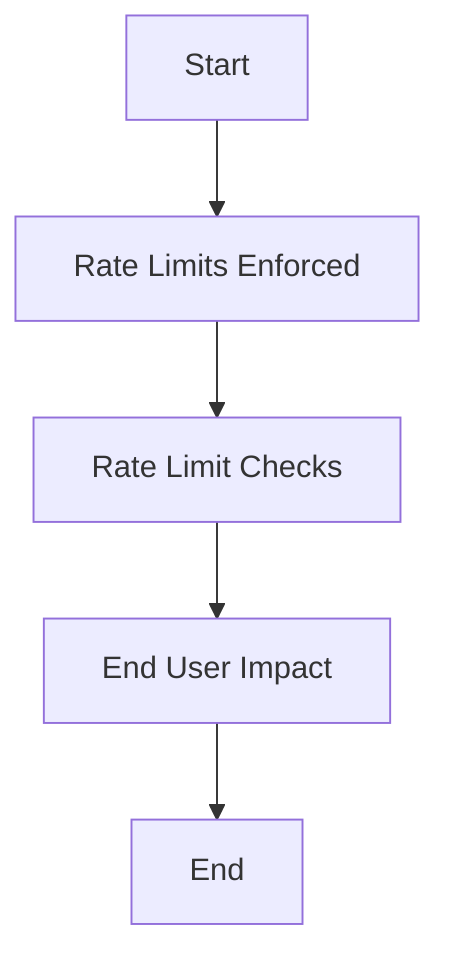

This document will cover the 'Rate Limits' feature of the sentry-demo repository. We'll cover:

1. The purpose of rate limits
2. How rate limits are enforced
3. The flow of rate limit checks
4. The impact of rate limits on end users.

Technical document: <SwmLink doc-title="Understanding Rate Limits">[Understanding Rate Limits](/.swm/understanding-rate-limits.lu30xz0f.sw.md)</SwmLink>

# Purpose of Rate Limits

Rate limits are a crucial feature in any application that deals with user-generated requests. They are designed to prevent abuse or overuse of resources by limiting the number of requests a user can make within a certain timeframe. In the context of the sentry-demo repository, rate limits are enforced on certain operations to ensure the stability and performance of the system.

# Enforcing Rate Limits

Rate limits are enforced through a function called 'rate_limits'. This function is a simple wrapper that calls another function, 'rate_limit_events'. The 'rate_limit_events' function contains the actual rate limiting logic. It checks the organization's rate limit configuration and returns the appropriate rate limit.

# Rate Limit Checks Flow

The flow of rate limit checks starts with the 'rate_limits' function. This function calls the 'rate_limit_events' function, which checks the organization's rate limit configuration. Depending on the configuration, it returns the appropriate rate limit. The 'get' function then handles incoming requests and uses several helper functions to process the request based on its parameters and the organization's settings. If the request exceeds the rate limit, it is denied, and the user is notified.

# Impact on End Users

Rate limits directly impact the end users of the application. If a user exceeds the rate limit, their request will be denied, and they will be notified of the rate limit violation. This can affect the user's experience, especially if they are making legitimate requests. However, rate limits are necessary to prevent abuse and ensure fair usage of resources among all users.

&nbsp;

*This is an auto-generated document by Swimm AI 🌊 and has not yet been verified by a human*

<SwmMeta version="3.0.0" repo-id="Z2l0aHViJTNBJTNBc2VudHJ5LWRlbW8lM0ElM0FTd2ltbS1EZW1v" repo-name="sentry-demo" doc-type="product-flows">Powered by [Swimm](/)</SwmMeta>
