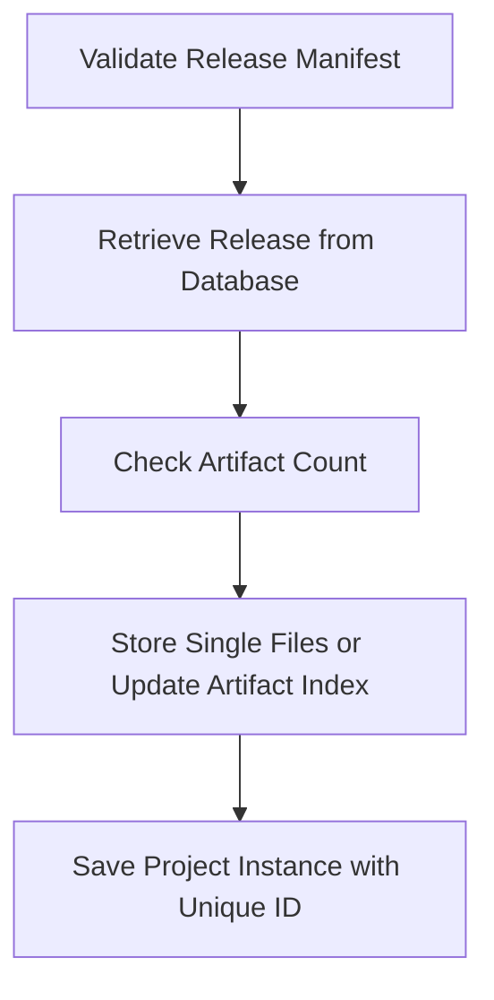

This document will cover the process of creating a release file in Sentry. We'll cover:

1. Validating the release manifest
2. Retrieving the release from the database
3. Checking the artifact count
4. Storing single files
5. Updating the artifact index
6. Saving the project instance with a unique ID.

Technical document: <SwmLink doc-title="Understanding _create_release_file Function">[Understanding \_create_release_file Function](/.swm/understanding-_create_release_file-function.rfc3e4ay.sw.md)</SwmLink>

# Validating the Release Manifest

The process begins by validating the manifest of the release against the organization and release version. This ensures that the release is associated with the correct organization and version.

# Retrieving the Release from the Database

Once the manifest is validated, the system attempts to retrieve the release from the database. If the release does not exist, an error is raised. This ensures that only existing releases are processed.

# Checking the Artifact Count

If the release exists, the system checks if the artifact count of the release is greater than or equal to the minimum artifact count. This ensures that the release has enough artifacts for processing.

# Storing Single Files

If the artifact count is less than the minimum, the system stores each file in the release individually. This ensures that all files in the release are accounted for.

# Updating the Artifact Index

If the artifact count is greater than or equal to the minimum, the system updates the artifact index with information from the release. This ensures that the artifact index is up-to-date.

# Saving the Project Instance with a Unique ID

Finally, the system saves the project instance with a unique ID. This ensures that each project instance is uniquely identifiable.

&nbsp;

*This is an auto-generated document by Swimm AI 🌊 and has not yet been verified by a human*

<SwmMeta version="3.0.0" repo-id="Z2l0aHViJTNBJTNBc2VudHJ5LWRlbW8lM0ElM0FTd2ltbS1EZW1v" repo-name="sentry-demo" doc-type="product-flows">Powered by [Swimm](/)</SwmMeta>
