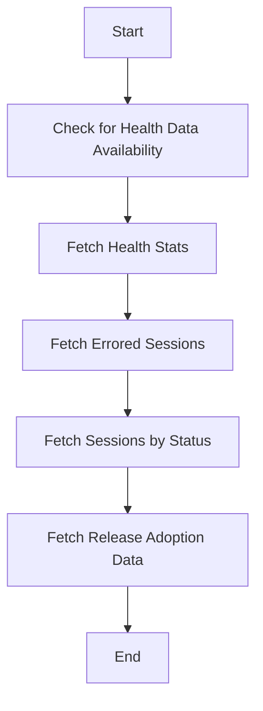

This document will provide an overview of the Release Health Data Retrieval process in the Sentry application. We'll cover the following aspects:

1. Checking for Health Data Availability
2. Fetching Health Stats
3. Fetching Errored Sessions
4. Fetching Sessions by Status
5. Fetching Release Adoption Data

Technical document: <SwmLink doc-title="Overview of Release Health Data Retrieval">[Overview of Release Health Data Retrieval](/.swm/overview-of-release-health-data-retrieval.ngf4bl1t.sw.md)</SwmLink>

# Checking for Health Data Availability

The process begins by checking if health data is available for the given projects or releases. This is done by querying the metrics for raw sessions and returning a set of projects or releases that have health data.

# Fetching Health Stats

Next, health stats for the given projects are fetched. This involves constructing a metrics query for either users or sessions, executing the query, and returning a mapping of project releases to their respective health stats.

# Fetching Errored Sessions

The process then fetches the count of errored sessions for the given projects. This involves constructing a metrics query for errored sessions, executing the query, and returning a mapping of project releases to their respective counts of errored sessions.

# Fetching Sessions by Status

The counts of sessions by their status for the given projects are then fetched. This involves constructing a metrics query for sessions by their status, executing the query, and returning a mapping of project releases and session status to their respective counts.

# Fetching Release Adoption Data

Finally, release adoption data is fetched. This involves preparing the necessary parameters and then calling a function to get the actual data. The function prepares common conditions and groupings for the query, and then calls other functions to get the number of users and sessions respectively.

&nbsp;

*This is an auto-generated document by Swimm AI 🌊 and has not yet been verified by a human*

<SwmMeta version="3.0.0" repo-id="Z2l0aHViJTNBJTNBc2VudHJ5LWRlbW8lM0ElM0FTd2ltbS1EZW1v" repo-name="sentry-demo" doc-type="product-flows">Powered by [Swimm](/)</SwmMeta>
