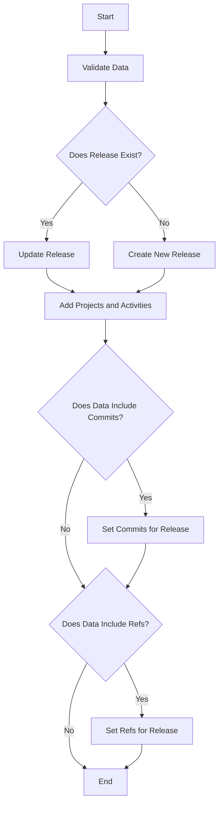

This document will cover the 'post' functionality in Sentry, which is a crucial part of the release management process. We'll cover:

1. The purpose of the 'post' functionality
2. How it validates and processes data
3. How it handles the creation and updating of releases
4. How it manages the addition of projects and activities to the release
5. How it sets commits and refs for the release.

Technical document: <SwmLink doc-title="post">[post](/.swm/understanding-the-post-functionality-in-sentry.9abbvuvl.sw.md)</SwmLink>

# Purpose of the 'post' Functionality

The 'post' functionality is a key component of the release management process in Sentry. It is responsible for creating a new release for a given organization. Releases in Sentry are used to improve error reporting abilities by correlating first seen events with the release that might have introduced the problem. They are also necessary for sourcemaps and other debug features that require manual upload for functioning well.

# Data Validation and Processing

The 'post' functionality begins by validating the data in the request. This includes checking the version identifier for the release, which can be a version number, a commit hash, etc. It also checks for an optional commit reference, which is useful if a tagged version has been provided. Additionally, it checks for a URL that points to the release, and a list of project slugs that are involved in the release.

# Creating and Updating Releases

Once the data is validated, the 'post' functionality checks if the release already exists. If it doesn't, it creates a new release. If the release already exists and the status has changed, it updates the status of the release.

# Managing Projects and Activities

The 'post' functionality also handles the addition of projects to the release and the creation of activities associated with the release. This ensures that all relevant projects and activities are linked to the release.

# Setting Commits and Refs

If the release data includes commits, the 'post' functionality sets the commits for the release. If the release data includes refs, it sets the refs for the release. This ensures that all relevant commits and refs are associated with the release.

&nbsp;

*This is an auto-generated document by Swimm AI 🌊 and has not yet been verified by a human*

<SwmMeta version="3.0.0" repo-id="Z2l0aHViJTNBJTNBc2VudHJ5LWRlbW8lM0ElM0FTd2ltbS1EZW1v" repo-name="sentry-demo" doc-type="product-flows">Powered by [Swimm](/)</SwmMeta>
