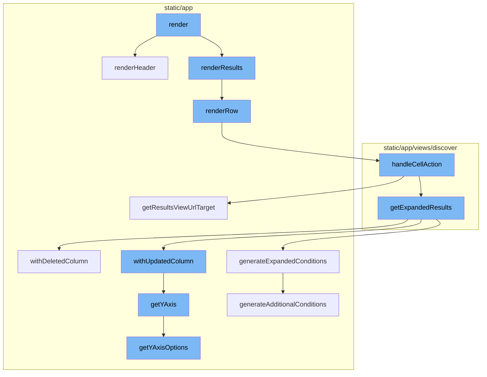

This document will cover the Render Flow feature, which includes:

1. Overview of the Render Flow
2. Understanding the Render Flow
3. Detailed explanation of each step in the Render Flow.

Technical document: <SwmLink doc-title="Understanding the Render Flow">[Understanding the Render Flow](/.swm/understanding-the-render-flow.80p89khf.sw.md)</SwmLink>

# Overview of the Render Flow

The render flow in this context refers to the sequence of function calls that are made to render the data. It starts with the `render` function, which then calls `renderResults`, `renderRow`, `handleCellAction`, `getExpandedResults`, `withUpdatedColumn`, `getYAxis`, and finally `getYAxisOptions`.

# Understanding the Render Flow

The Render Flow is a sequence of steps that are made to display data on the screen. It begins with the rendering of the main component. If data is available, it generates the headers and results of the transactions table. For each column, it determines the alignment of the column. If a cell action is performed, it handles different actions and updates the query accordingly. After updating the query, it redirects to the new URL. It also converts an aggregated query into one that does not have aggregates and applies additional conditions. It removes a column from the event view if the column to be deleted is one of the sorted columns. It creates additional conditions based on the fields in an EventView and a datarow/event. It removes any aggregates from the search conditions to avoid leading to an invalid query result. It updates a column in the event view. If the updated column is one of the sorted columns, it may need to be removed from the list of sorts. It gets the Y-axis of the event view and ensures that the current selected Y-axis is one of the items in Y-axis options.

# Detailed explanation of each step in the Render Flow

The `render` function is the main function responsible for rendering the transactions table. It uses the `isLoading` and `tableData` props to determine the state of the table. If data is available, it calls `renderHeader` and `renderResults` to render the table headers and results respectively. The `renderHeader` function is called within the `render` function to generate the headers of the transactions table. It uses the `tableData` and `columnOrder` props to create the headers. For each column, it calls the `fieldAlignment` function to determine the alignment of the column. The `fieldAlignment` function is used to determine the alignment of a column in the transactions table. It takes the column name, column type, and metadata as parameters and returns the alignment ('left' or 'right'). The `renderResults` function is the starting point of the render flow. It checks if the data is loading or if there's no data available. If there's data, it iterates over each row of the data, calling the `renderRow` function for each row and concatenating the results. The `renderRow` function is responsible for rendering each row of the table. It maps over each column in the row, rendering the appropriate field for each column. If a `handleCellAction` function is provided, it wraps the rendered cell in a `CellAction` component. The `handleCellAction` function is triggered when a cell action is performed. It handles different actions like `RELEASE` and `DRILLDOWN`, and updates the query accordingly. After updating the query, it redirects to the new URL using `browserHistory.push`. The `getResultsViewUrlTarget` function is used to generate the URL for the results view. It takes the organization slug and a boolean indicating if it's the homepage as parameters, and returns an object containing the pathname and query string. The `generateQueryStringObject` function is used to generate the query string object for the URL. It includes all the necessary parameters like `id`, `name`, `field`, `sort`, `environment`, `project`, `query`, `yAxis`, `dataset`, `display`, `topEvents`, and `interval`. The `getExpandedResults` function is used to convert an aggregated query into one that does not have aggregates. It also applies additional conditions defined in `additionalConditions` and generates conditions based on the `dataRow` parameter and the current fields in the `eventView`. The `withDeletedColumn` method is used to remove a column from the event view. If the column to be deleted is one of the sorted columns, it is removed from the list of sorts. The `generateExpandedConditions` function is used to create additional conditions based on the fields in an EventView and a datarow/event. It removes any aggregates from the search conditions to avoid leading to an invalid query result. The `withUpdatedColumn` method is used to update a column in the event view. If the updated column is one of the sorted columns, it may need to be removed from the list of sorts. The `getYAxis` method is used to get the Y-axis of the event view. It ensures that the current selected Y-axis is one of the items in Y-axis options. The `getYAxisOptions` method is used to get the Y-axis options of the event view. It only includes aggregates that make sense to be graphable.

&nbsp;

*This is an auto-generated document by Swimm AI 🌊 and has not yet been verified by a human*

<SwmMeta version="3.0.0" repo-id="Z2l0aHViJTNBJTNBc2VudHJ5LWRlbW8lM0ElM0FTd2ltbS1EZW1v" repo-name="sentry-demo" doc-type="product-flows">Powered by [Swimm](/)</SwmMeta>
