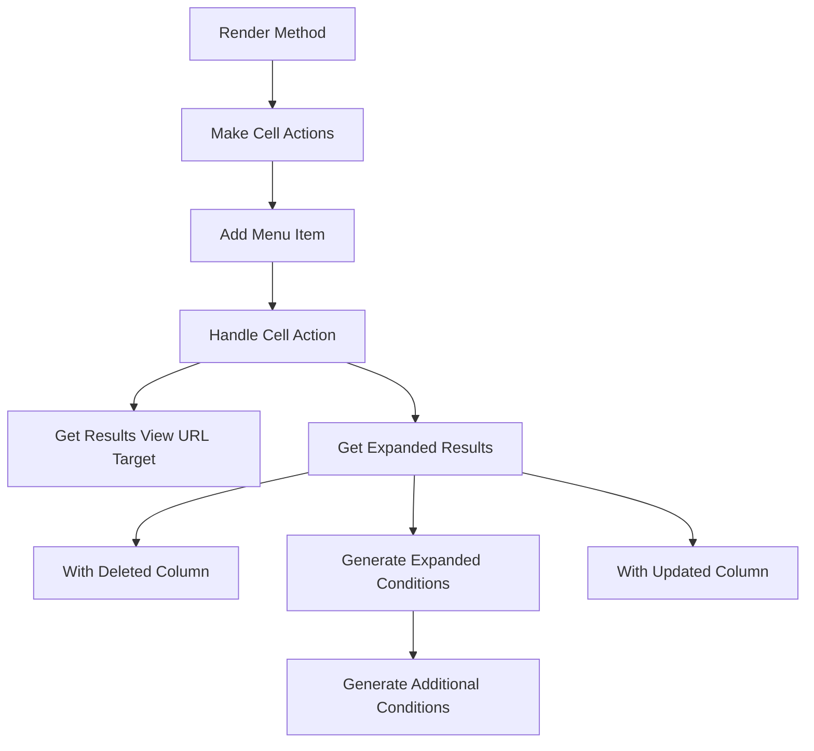

This document will cover the 'Render Flow' feature of the Sentry application. We'll cover:

1. The purpose of the Render Flow
2. The steps involved in the Render Flow
3. The impact of each step on the end user experience.

Technical document: <SwmLink doc-title="Understanding the Render Flow">[Understanding the Render Flow](/.swm/understanding-the-render-flow.vbjnkcs6.sw.md)</SwmLink>

# Purpose of the Render Flow

The Render Flow is a crucial part of the Sentry application's user interface. It is responsible for creating and displaying the interactive elements (cell actions) within the application. These cell actions allow users to interact with the data presented in the application, enabling them to perform various actions such as sorting, filtering, and navigating to different views.

# Steps involved in the Render Flow

The Render Flow consists of several steps, each contributing to the final user interface that the end user interacts with. The steps include:

1. Render Method: This is the starting point of the flow. It prepares the properties of the component for further processing.
2. Make Cell Actions: This step creates a list of actions based on the data row and column.
3. Add Menu Item: This step adds an action to the list of actions.
4. Handle Cell Action: This step handles the action when it is triggered by the user.
5. Get Results View URL Target: This step gets the URL target for the results view.
6. Get Expanded Results: This step converts an aggregated query into one that does not have aggregates.
7. With Deleted Column: This step removes a column from the EventView.
8. Generate Expanded Conditions: This step generates additional conditions for the EventView.
9. With Updated Column: This step updates a column in the EventView.

# Impact on the end user experience

Each step in the Render Flow contributes to the end user experience. The creation of cell actions allows users to interact with the data in meaningful ways. The handling of cell actions ensures that the user's actions trigger the appropriate responses in the application. The generation of the results view URL target and the expanded results provide the user with the correct view based on their actions. The deletion and updating of columns in the EventView ensure that the user sees the most relevant and up-to-date information.

&nbsp;

*This is an auto-generated document by Swimm AI 🌊 and has not yet been verified by a human*

<SwmMeta version="3.0.0" repo-id="Z2l0aHViJTNBJTNBc2VudHJ5LWRlbW8lM0ElM0FTd2ltbS1EZW1v" repo-name="sentry-demo" doc-type="product-flows">Powered by [Swimm](/)</SwmMeta>
