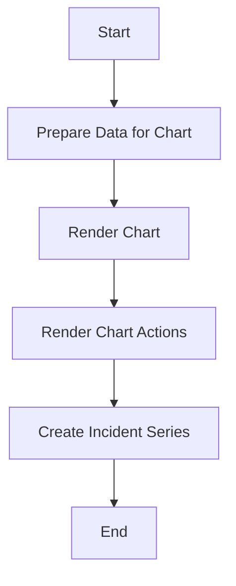

This document will cover the 'Render Flow' feature of the Sentry application. We'll cover:

1. The purpose of the Render Flow
2. The process of preparing data for rendering the chart
3. The process of rendering the chart
4. The process of rendering the chart actions
5. The process of creating a series for an incident on the chart.

Technical document: <SwmLink doc-title="Understanding the Render Flow">[Understanding the Render Flow](/.swm/understanding-the-render-flow.kj93rc2p.sw.md)</SwmLink>

# Purpose of the Render Flow

The Render Flow is a crucial part of the Sentry application. It is responsible for rendering the metric alert charts that provide users with visual representations of their data. This allows users to easily understand and analyze their data.

# Preparing Data for Rendering the Chart

The first step in the Render Flow is to prepare the necessary data for rendering the chart. Depending on the dataset, the application either makes a 'SessionsRequest' or an 'EventsRequest'. The response from these requests is then passed to the next step in the flow, which is the 'renderChart' method. This step ensures that the correct data is retrieved and ready for rendering.

# Rendering the Chart

The 'renderChart' method is responsible for rendering the chart. It first checks if the data is loading or if there is no data. If there is no data, it calls the 'renderEmpty' method, which displays a message to the user indicating that there is no data to display. If there is data, it prepares the chart options and additional series, and then renders the chart using the 'AreaChart' component. It also prepares the tooltip formatter for the chart. This step ensures that the data is correctly displayed in a visual format that is easy for the user to understand.

# Rendering the Chart Actions

The 'renderChartActions' method is responsible for rendering the chart actions. It calculates the percentages for resolved, warning, critical, and waiting for data durations. It then renders these percentages along with a button that links to either the Discover or Metrics page, depending on the aggregate of the rule. This step provides the user with additional information and actions related to their data.

# Creating a Series for an Incident on the Chart

The 'createIncidentSeries' function is used to create a series for an incident on the chart. It takes in several arguments including the incident, line color, incident timestamp, and a callback function for handling incident clicks. It returns an object that represents a series on the chart. This step allows the application to display incidents on the chart, providing the user with a visual representation of incidents.

&nbsp;

*This is an auto-generated document by Swimm AI 🌊 and has not yet been verified by a human*

<SwmMeta version="3.0.0" repo-id="Z2l0aHViJTNBJTNBc2VudHJ5LWRlbW8lM0ElM0FTd2ltbS1EZW1v" repo-name="sentry-demo" doc-type="product-flows">Powered by [Swimm](/)</SwmMeta>
