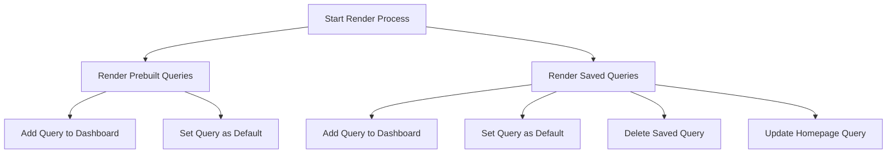

This document will cover the process of rendering data in the Sentry application. We'll cover:

1. The purpose of the render process
2. How prebuilt and saved queries are rendered
3. How queries are added to the dashboard and set as default
4. How saved queries are deleted and updated

Technical document: <SwmLink doc-title="Understanding the Render Process">[Understanding the Render Process](/.swm/understanding-the-render-process.i2yckw4g.sw.md)</SwmLink>

# Purpose of the Render Process

The render process is a crucial part of the application flow in Sentry. It is responsible for displaying the application's data to the user. This includes both prebuilt and saved queries.

# Rendering Prebuilt Queries

Prebuilt queries are predefined queries that are included in the application. The render process maps over these prebuilt queries and creates a view for each one. If a search is performed on the list of queries, the pre-built queries are filtered accordingly. Each query is then presented with a list of menu items, which includes options to add the query to the dashboard and set it as default.

# Rendering Saved Queries

Saved queries are queries that have been created and saved by the user. The render process takes these saved queries and creates a view for each one. Each saved query is presented with a context menu with options to add the query to a dashboard, set it as default, duplicate the query, or delete the query.

# Adding Queries to the Dashboard

Queries can be added to the dashboard for easy access. This is done by selecting the 'Add to Dashboard' option from the menu items of a query. The application prepares the data for the widget, constructs the link for adding the query to the dashboard, and opens the modal for adding to the dashboard.

# Setting Queries as Default

Queries can be set as default for the Discover homepage. This is done by selecting the 'Set as Default' option from the menu items of a query. The application sends a request to the server to update the homepage query and handles the response by displaying a success or error message.

# Deleting Saved Queries

Saved queries can be deleted by the user. This is done by selecting the 'Delete' option from the context menu of a saved query. The application sends a delete request to the server and handles the response by displaying a success or error message.

# Updating Saved Queries

Saved queries can be updated by the user. This is done by selecting the 'Update' option from the context menu of a saved query. The application sends a request to the server to update the saved query and handles the response by displaying a success or error message.

&nbsp;

*This is an auto-generated document by Swimm AI 🌊 and has not yet been verified by a human*

<SwmMeta version="3.0.0" repo-id="Z2l0aHViJTNBJTNBc2VudHJ5LWRlbW8lM0ElM0FTd2ltbS1EZW1v" repo-name="sentry-demo" doc-type="product-flows">Powered by [Swimm](/)</SwmMeta>
