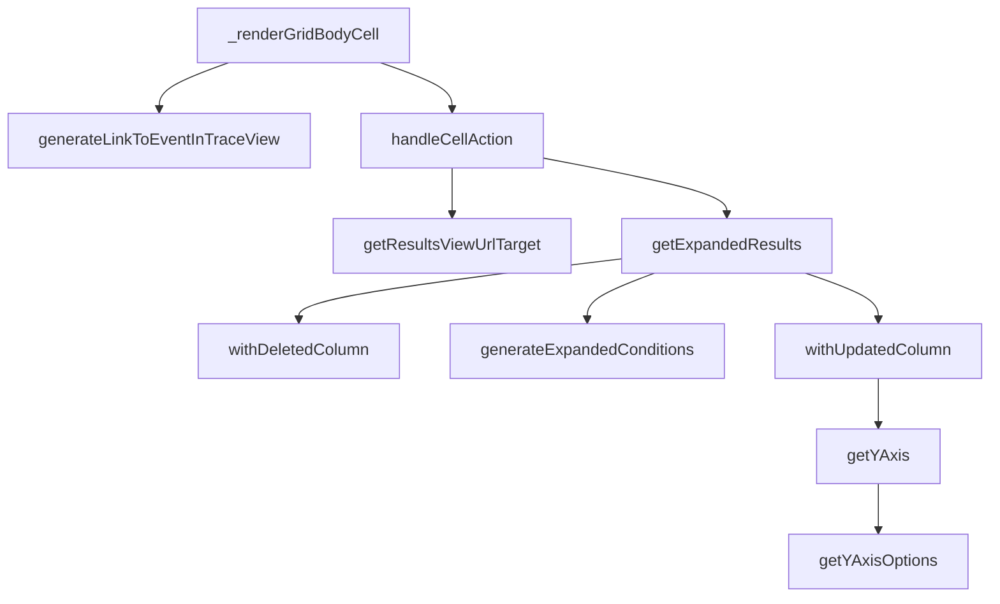

This document will cover the process of rendering grid cells in the Sentry application. We'll cover:

1. The role of the \_renderGridBodyCell function
2. How links to different views are generated
3. How the application handles cell actions
4. How the application expands results and generates conditions

Technical document: <SwmLink doc-title="Understanding _renderGridBodyCell">[Understanding \_renderGridBodyCell](/.swm/understanding-_rendergridbodycell.mx3az8gp.sw.md)</SwmLink>

# The role of the \_renderGridBodyCell function

The \_renderGridBodyCell function is a key component in the Sentry application. It is responsible for rendering individual cells within a grid body. This function is used extensively in the Discover module of the application. The function first checks if there is table data and if not, it returns the dataRow for the given column key. It then uses the getFieldRenderer function to get the field renderer for the column key. Depending on the column key, it generates different types of cells, such as links to event details, transaction details, trace details, replay links, and profile flamechart links. It also handles the rendering of top results indicators and tooltips for large integer values.

# How links to different views are generated

The generateLinkToEventInTraceView function is used within \_renderGridBodyCell to generate a URL to the trace view or the event details view depending on the feature flag. It takes in parameters such as organization, location, spanId, projectSlug, timestamp, traceSlug, eventId, transactionName, eventView, demo, source, and type. Depending on the organization's features, it returns either the trace details URL or the transaction details URL. The generateQueryStringObject method is used within generateLinkToEventInTraceView to generate a query string object from the event view. It returns an object with properties such as id, name, field, widths, sort, environment, project, query, yAxis, dataset, display, topEvents, and interval. The fromLocation method is used within generateLinkToEventInTraceView to create a new event view from the location. It decodes various parameters from the location query and returns a new EventView object.

# How the application handles cell actions

The handleCellAction function is the starting point of our flow. It takes a data row and a column as parameters. Depending on the action performed, it either navigates to a specific release or drills down into each distinct value and gets a count for each value. In the case of a drilldown, it calls getExpandedResults to get the expanded results and then calls getResultsViewUrlTarget to get the URL target for the results view.

# How the application expands results and generates conditions

The getExpandedResults function is the starting point of the flow. It converts an aggregated query into one that does not have aggregates. It also applies additional conditions defined in additionalConditions and generates conditions based on the dataRow parameter and the current fields in the eventView. The withDeletedColumn method is called within getExpandedResults. It removes a column from the EventView and adjusts the sort keys and yAxis accordingly. The generateExpandedConditions function is also called within getExpandedResults. It generates additional conditions based on the fields in an EventView and a dataRow/event. The withUpdatedColumn method is called within getExpandedResults. It updates a column in the EventView and adjusts the sort keys and yAxis accordingly. The getYAxis method is called within withUpdatedColumn and withDeletedColumn. It returns the yAxis of the EventView, ensuring that the current selected yAxis is one of the items in yAxisOptions. The getYAxisOptions method is called within getYAxis. It returns the yAxis options of the EventView, including only aggregates that are graphable.

&nbsp;

*This is an auto-generated document by Swimm AI 🌊 and has not yet been verified by a human*

<SwmMeta version="3.0.0" repo-id="Z2l0aHViJTNBJTNBc2VudHJ5LWRlbW8lM0ElM0FTd2ltbS1EZW1v" repo-name="sentry-demo" doc-type="product-flows">Powered by [Swimm](/)</SwmMeta>
