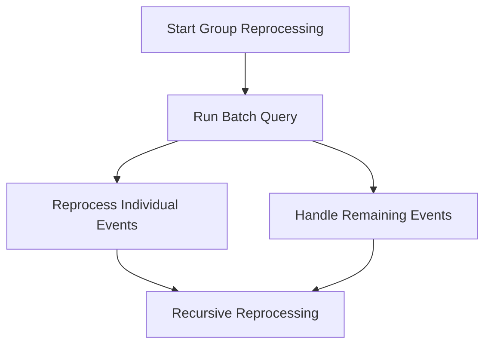

This document will cover the Reprocessing Group Function in Sentry, which includes:

1. The initiation of group reprocessing
2. Running a batch query to retrieve events
3. Handling remaining events
4. Reprocessing individual events
5. Recursive reprocessing for remaining events.

Technical document: <SwmLink doc-title="Understanding the Reprocessing Group Function">[Understanding the Reprocessing Group Function](/.swm/understanding-the-reprocessing-group-function.udtj0fsq.sw.md)</SwmLink>

# Initiation of Group Reprocessing

The reprocessing of a group of events begins when the Reprocessing Group Function is called for the first time. At this point, the function sets the start time to the current time and initiates the reprocessing of the group.

# Running a Batch Query

The function then runs a batch query to retrieve a set of events from the group that needs to be reprocessed. This is done to ensure that the reprocessing is done in manageable chunks, rather than attempting to reprocess all events at once.

# Handling Remaining Events

If there are no events returned from the batch query, the function handles any remaining events that belong to the new group generated after reprocessing. This ensures that all events are accounted for and reprocessed as necessary.

# Reprocessing Individual Events

For each event in the batch, the function checks if the maximum events limit has been reached. If not, it reprocesses the event. If there are any errors during reprocessing or if the maximum events limit has been reached, the function adds the event to a list of remaining events to be reprocessed later.

# Recursive Reprocessing

Finally, the function calls itself recursively with the updated parameters to continue the reprocessing of the remaining events in the group. This ensures that all events in the group are reprocessed, even if there are errors or if the maximum events limit is reached.

&nbsp;

*This is an auto-generated document by Swimm AI 🌊 and has not yet been verified by a human*

<SwmMeta version="3.0.0" repo-id="Z2l0aHViJTNBJTNBc2VudHJ5LWRlbW8lM0ElM0FTd2ltbS1EZW1v" repo-name="sentry-demo" doc-type="product-flows">Powered by [Swimm](/)</SwmMeta>
