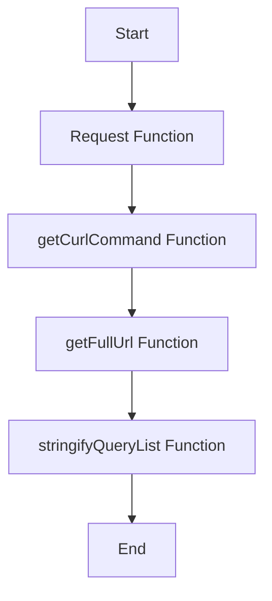

This document will provide a detailed understanding of the Request Flow in Sentry. We'll cover:

1. The purpose of the Request Flow
2. The steps involved in the Request Flow
3. The impact of each step on the end user.

Technical document: <SwmLink doc-title="Understanding the Request Flow">[Understanding the Request Flow](/.swm/understanding-the-request-flow.vzjljx2f.sw.md)</SwmLink>

# Purpose of the Request Flow

The Request Flow is a sequence of operations that Sentry uses to process incoming requests. It starts with the Request function, which checks if the incoming data has a method and URL. If these are missing, the request is considered partial, and the system proceeds to get the full URL of the request. This flow is crucial for Sentry's error tracking and performance monitoring capabilities.

# Steps involved in the Request Flow

The Request Flow consists of four main steps:

1. The Request function: This is the starting point of the flow. It checks if the incoming data has a method and URL. If these are missing, the request is considered partial.
2. The getCurlCommand function: This function constructs a curl command using the data from the request. It checks for the method, headers, and data in the request.
3. The getFullUrl function: This function constructs the full URL of the request. It checks if the data has a query or fragment and appends it to the URL.
4. The stringifyQueryList function: This function takes the query from the request and stringifies it. If the query is already a string, it returns it as is. If the query is an array, it converts it into a string.

# Impact of each step on the end user

Each step in the Request Flow has a direct impact on the end user's experience. The Request function ensures that the incoming request is valid, which helps prevent errors and improve performance. The getCurlCommand function constructs a curl command, which is essential for making HTTP requests. The getFullUrl function constructs the full URL of the request, ensuring that the request is directed to the correct location. Finally, the stringifyQueryList function ensures that the query is in the correct format, which is crucial for processing the request correctly.

&nbsp;

*This is an auto-generated document by Swimm AI 🌊 and has not yet been verified by a human*

<SwmMeta version="3.0.0" repo-id="Z2l0aHViJTNBJTNBc2VudHJ5LWRlbW8lM0ElM0FTd2ltbS1EZW1v" repo-name="sentry-demo" doc-type="product-flows">Powered by [Swimm](/)</SwmMeta>
