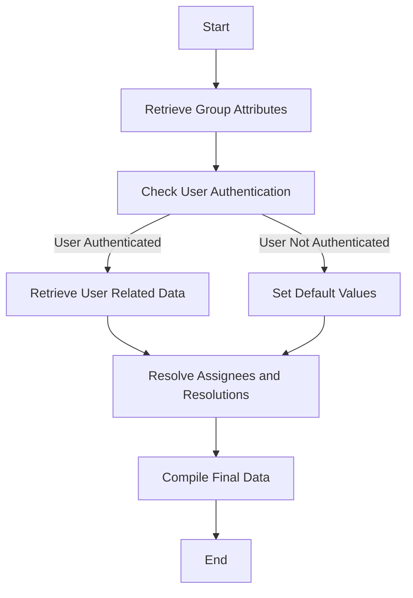

This document will cover the process of retrieving and processing group attributes in Sentry. We'll cover:

1. The purpose of retrieving group attributes
2. How user authentication affects the process
3. The process of resolving assignees and resolutions
4. The final compilation of data.

Technical document: <SwmLink doc-title="Understanding the get_attrs Function">[Understanding the get_attrs Function](/.swm/understanding-the-get_attrs-function.8m95c50m.sw.md)</SwmLink>

# Purpose of Retrieving Group Attributes

The process of retrieving group attributes is crucial for providing a comprehensive view of each group's status and related data. This includes information such as the group's assignee, bookmark status, subscription status, seen status, annotations, ignore status, resolution, share id, and authorization status. This information is essential for users to understand the current state and context of each group.

# User Authentication

User authentication plays a significant role in this process. If the user is authenticated, the system retrieves bookmarks, seen groups, and subscriptions related to the user and the groups. If the user is not authenticated or the group list is empty, it sets bookmarks, seen groups, and subscriptions to their default values. This ensures that only relevant and authorized data is presented to the user.

# Resolving Assignees and Resolutions

The system then resolves assignees for the groups and any release or commit resolutions. It also retrieves any users related to the resolutions or ignored items and serializes them. This step is crucial for understanding who is responsible for each group and what actions have been taken or are planned for the group.

# Final Data Compilation

Finally, all the retrieved and processed data is compiled into a result dictionary. This dictionary provides a comprehensive view of each group's status and related data, making it easy for users to understand the current state and context of each group.

&nbsp;

*This is an auto-generated document by Swimm AI 🌊 and has not yet been verified by a human*

<SwmMeta version="3.0.0" repo-id="Z2l0aHViJTNBJTNBc2VudHJ5LWRlbW8lM0ElM0FTd2ltbS1EZW1v" repo-name="sentry-demo" doc-type="product-flows">Powered by [Swimm](/)</SwmMeta>
