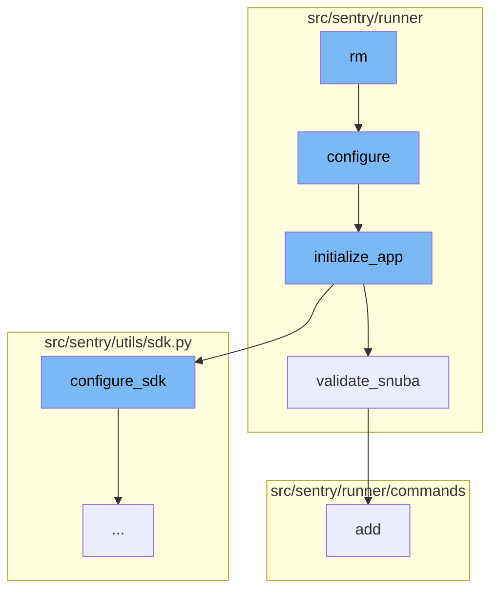

This document will cover the 'rm' function flow, which includes:

1. Shutting down and deleting all services and associated data.
2. Setting up the environment.
3. Initializing the application.
4. Ensuring everything related to Snuba is in sync.
5. Setting up the Sentry SDK.
6. Capturing any event.

Technical document: <SwmLink doc-title="rm">[rm](/.swm/understanding-the-rm-function.sy0i8atp.sw.md)</SwmLink>

# Shutting down and deleting all services and associated data

The 'rm' function is used to shut down and delete all services and associated data. This is useful when you want to start with a fresh slate. The function takes two parameters: 'project' and 'services'. It first imports the 'configure' function from 'sentry.runner' and calls it. Then it prepares the containers and if any services are specified, it selects only those containers. Finally, it stops and removes the containers and their associated volumes.

# Setting up the environment

The 'configure' function is used to set up the environment given two different config files. It adds additional mimetypes that are useful for static files and checks if the configuration file exists. If the configuration file does not exist, it raises an exception. It also sets the 'DJANGO_SETTINGS_MODULE' environment variable to 'sentry.runner.default_settings' and calls the 'initialize_app' function.

# Initializing the application

The 'initialize_app' function is used to initialize the application with the given configuration. It sets up various settings, validates the regions, options, and Snuba configuration, configures the SDK, and sets up the services. It also dynamically sets the 'CSRF_TRUSTED_ORIGINS' for self-hosted setups.

# Ensuring everything related to Snuba is in sync

The 'validate_snuba' function is used to ensure everything related to Snuba is in sync. It checks if all Snuba required backends are set and if the eventstream is Snuba compatible. If there are any inconsistencies, it raises a 'ConfigurationError'.

# Setting up the Sentry SDK

'configure_sdk' is a crucial part of the flow. It is responsible for setting up the Sentry SDK. It includes methods like 'capture_envelope', 'capture_event', '\_capture_anything', 'record_lost_event', 'is_healthy', and 'flush' which are all related to event capturing and transport health checks.

# Capturing any event

The '\_capture_anything' function is a part of the Sentry SDK. It is responsible for capturing events and metrics. It first checks if the 'sentry4sentry_transport' is available, if so, it increments the 'internal.captured.events.upstream' metric. It also checks if the 'SENTRY_SDK_UPSTREAM_METRICS_ENABLED' setting is enabled and the method name is 'capture_envelope'. If these conditions are met, it filters out all the 'statsd' envelope items and sends them to the 'sentry4sentry_transport'.

&nbsp;

*This is an auto-generated document by Swimm AI 🌊 and has not yet been verified by a human*

<SwmMeta version="3.0.0" repo-id="Z2l0aHViJTNBJTNBc2VudHJ5LWRlbW8lM0ElM0FTd2ltbS1EZW1v" repo-name="sentry-demo" doc-type="product-flows">Powered by [Swimm](/)</SwmMeta>
