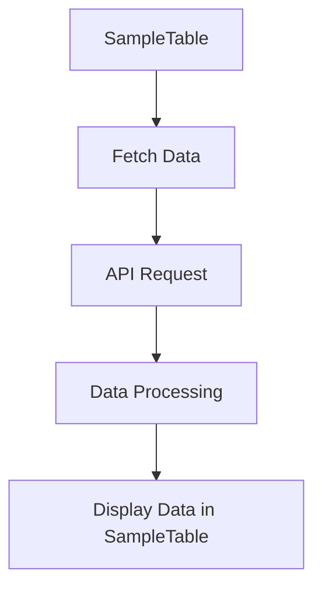

This document will cover the SampleTable feature of the Sentry application. We'll cover:

1. What is SampleTable and its purpose
2. How data is fetched and processed for SampleTable
3. The flow of data from API request to data processing

Technical document: <SwmLink doc-title="Understanding SampleTable">[Understanding SampleTable](/.swm/understanding-sampletable.3bfoyyp9.sw.md)</SwmLink>

# SampleTable Overview

SampleTable is a feature in the Sentry application that displays a table of samples. It fetches and manages the data it needs based on various properties such as groupId, moduleName, transactionName, and others. These properties are used to filter and fetch the data that is displayed in the SampleTable.

# Data Fetching

SampleTable uses several hooks to fetch data. The data is fetched based on an array of event IDs. These hooks use various functions to fetch the required data. The data is then prepared for the API request.

# API Request

The necessary data and conditions for the API request are prepared. The actual API request is made using a function that handles the low-level details of the API request.

# Data Processing

Once the data is fetched, it is processed. The data is fetched based on the provided search, fields, page filters, yAxis, top events, and dataset. The processed data is then displayed in the SampleTable.

&nbsp;

*This is an auto-generated document by Swimm AI 🌊 and has not yet been verified by a human*

<SwmMeta version="3.0.0" repo-id="Z2l0aHViJTNBJTNBc2VudHJ5LWRlbW8lM0ElM0FTd2ltbS1EZW1v" repo-name="sentry-demo" doc-type="product-flows">Powered by [Swimm](/)</SwmMeta>
