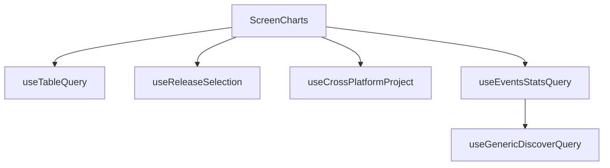

This document will provide a detailed understanding of the 'ScreenCharts' feature in the Sentry application. We will cover the following aspects:

1. Gathering and processing data for ScreenCharts
2. Fetching data for the table
3. Fetching data about the selected releases
4. Fetching data about the selected project
5. Fetching data about the events stats
6. Fetching data from the server

Technical document: <SwmLink doc-title="Understanding ScreenCharts">[Understanding ScreenCharts](/.swm/understanding-screencharts.5runol66.sw.md)</SwmLink>

# Gathering and Processing Data for ScreenCharts

The ScreenCharts feature is a crucial part of the Sentry application. It gathers and processes data to render charts that provide insights into the application's performance. The data is gathered using various hooks and functions. The 'usePageFilters', 'useLocation', and 'useCrossPlatformProject' hooks are used to get the necessary data for processing. A memoized version of the query string is created using the 'useMemo' hook. The 'useTableQuery' function fetches data for the table, and the 'transformDeviceClassEvents' function transforms the fetched data into a format suitable for rendering in the charts.

# Fetching Data for the Table

The 'useTableQuery' function is a custom hook that fetches data for the table. It uses the 'useLocation', 'useOrganization', and 'usePageFilters' hooks to get the necessary data for the query. It then uses the 'useDiscoverQuery' function to fetch the data from the server.

# Fetching Data About the Selected Releases

The 'useReleaseSelection' function is a custom hook that fetches data about the selected releases. It uses the 'useLocation' hook to get the current location, and the 'useReleases' function to fetch the data about the releases. It then processes the fetched data to determine the primary and secondary releases.

# Fetching Data About the Selected Project

The 'useCrossPlatformProject' function is a custom hook that fetches data about the selected project. It uses the 'usePageFilters' and 'useProjects' hooks to get the necessary data for the query. It then processes the fetched data to determine if the project is cross-platform and to get the selected platform.

# Fetching Data About the Events Stats

The 'useEventsStatsQuery' function is a custom hook that fetches data about the events stats. It uses the 'useLocation' and 'useOrganization' hooks to get the necessary data for the query. It then uses the 'useGenericDiscoverQuery' function to fetch the data from the server.

# Fetching Data from the Server

The 'useGenericDiscoverQuery' function is a generic function that fetches data from the server. It uses the 'useApi' hook to get the API instance, and then uses it to send a request to the server. The response from the server is then processed and returned.

&nbsp;

*This is an auto-generated document by Swimm AI 🌊 and has not yet been verified by a human*

<SwmMeta version="3.0.0" repo-id="Z2l0aHViJTNBJTNBc2VudHJ5LWRlbW8lM0ElM0FTd2ltbS1EZW1v" repo-name="sentry-demo" doc-type="product-flows">Powered by [Swimm](/)</SwmMeta>
