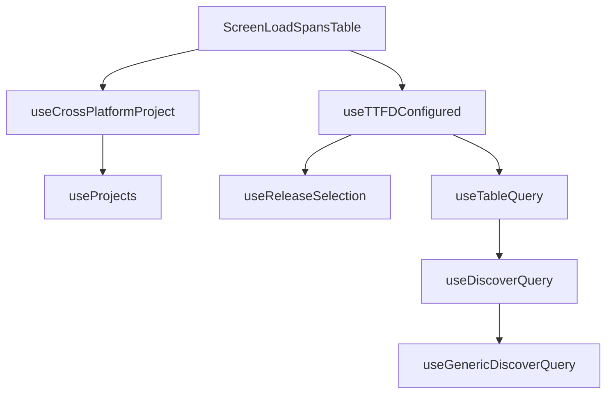

This document will cover the 'ScreenLoadSpansTable' feature, which includes:

1. Determining if the project is cross-platform
2. Fetching projects from the ProjectsStore
3. Getting the primary and secondary releases
4. Executing a query to fetch data
5. Displaying a table of span metrics.

Technical document: <SwmLink doc-title="Understanding ScreenLoadSpansTable">[Understanding ScreenLoadSpansTable](/.swm/understanding-screenloadspanstable.10wav5z6.sw.md)</SwmLink>

# Determining if the project is cross-platform

The 'ScreenLoadSpansTable' feature starts by determining if the selected project is cross-platform. This is done by checking the current selection and the list of projects. If the selected project is cross-platform, it is marked as such.

# Fetching projects from the ProjectsStore

The feature fetches projects from the ProjectsStore. This provides a way to select specific project slugs and search for more projects that may not be in the project store.

# Getting the primary and secondary releases

The feature then gets the primary and secondary releases. If there are more than one release, the older one is set as the primary release and the newest one as the secondary release.

# Executing a query to fetch data

A query is constructed with the current location, organization, and selection filters, and is then executed to fetch data. The data returned from the query is checked for a non-zero time to initial display (TTFD) and a zero time to full display (TTFD).

# Displaying a table of span metrics

Finally, the returned data is used to render a table of span metrics. This table provides a visual representation of the span metrics for the user.

&nbsp;

*This is an auto-generated document by Swimm AI 🌊 and has not yet been verified by a human*

<SwmMeta version="3.0.0" repo-id="Z2l0aHViJTNBJTNBc2VudHJ5LWRlbW8lM0ElM0FTd2ltbS1EZW1v" repo-name="sentry-demo" doc-type="product-flows">Powered by [Swimm](/)</SwmMeta>
