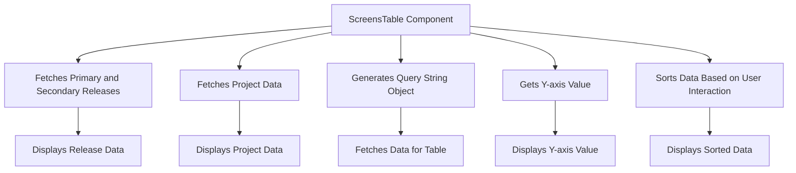

This document will provide a detailed understanding of the 'ScreensTable' component in the Sentry application. We'll cover:

1. The purpose of the ScreensTable component
2. How it fetches and displays data
3. The flow of data and interactions within the component.

Technical document: <SwmLink doc-title="Understanding the ScreensTable Component">[Understanding the ScreensTable Component](/.swm/understanding-the-screenstable-component.p1zri63z.sw.md)</SwmLink>

# Purpose of the ScreensTable Component

The ScreensTable component is a crucial part of the Sentry application. It displays screen load data, which is essential for users to understand the performance of their applications. The component fetches and processes the necessary data to provide a comprehensive view of screen load times.

# Fetching and Displaying Data

The ScreensTable component fetches the primary and secondary releases using the 'useReleaseSelection' hook. It also fetches the project data using the 'useCrossPlatformProject' hook. The fetched data is then displayed in the table, providing users with a detailed view of the screen load times for different releases and projects.

# Flow of Data and Interactions within the Component

The ScreensTable component generates a query string object based on the current state of the 'eventView' object. This object is used to fetch the data for the table. The component also gets the current Y-axis value, which is displayed in the table. When a user interacts with the table, such as sorting the data, the component updates the displayed data accordingly. This ensures that users always have an up-to-date view of the screen load times.

&nbsp;

*This is an auto-generated document by Swimm AI 🌊 and has not yet been verified by a human*

<SwmMeta version="3.0.0" repo-id="Z2l0aHViJTNBJTNBc2VudHJ5LWRlbW8lM0ElM0FTd2ltbS1EZW1v" repo-name="sentry-demo" doc-type="product-flows">Powered by [Swimm](/)</SwmMeta>
