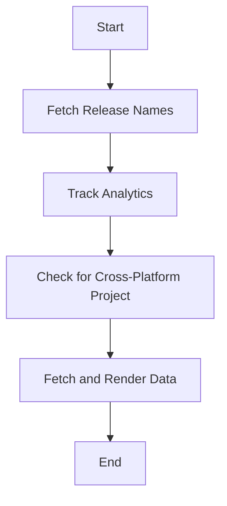

This document will provide a detailed explanation of the 'ScreensView' feature in the Sentry application. We'll cover the following aspects:

1. Overview of the ScreensView feature
2. The process of fetching and displaying release names
3. The role of analytics tracking in ScreensView
4. The significance of cross-platform projects in ScreensView
5. The flow of data fetching and rendering in ScreensView

Technical document: <SwmLink doc-title="Understanding ScreensView">[Understanding ScreensView](/.swm/understanding-screensview.iiig61n3.sw.md)</SwmLink>

# Overview of the ScreensView Feature

ScreensView is a component in the Sentry application that is responsible for rendering the screen view for mobile insights. It gathers necessary data and configurations, constructs queries to fetch the required data, and then renders the charts and tables.

# Fetching and Displaying Release Names

The ScreensView feature fetches the primary and secondary release names in a truncated format. This is particularly useful when the release names need to be displayed in a limited space, such as in a chart label. The release names are selected based on the location query or the releases data.

# Tracking Analytics in ScreensView

The ScreensView feature also tracks analytics related to the data. It keeps track of whether the module has ever sent data. This information is crucial for understanding the usage patterns and performance of the module.

# Significance of Cross-Platform Projects in ScreensView

The ScreensView feature checks if the selected project is a cross-platform project. If it is, a filter is conditionally added to the query. This is important because the data requirements and rendering might differ for cross-platform projects.

# Data Fetching and Rendering in ScreensView

The ScreensView feature fetches the necessary data based on the constructed queries. It fetches data related to the primary and secondary releases, projects, and other relevant information. Once the data is fetched, it is used to render the charts and tables for the screen view.

&nbsp;

*This is an auto-generated document by Swimm AI 🌊 and has not yet been verified by a human*

<SwmMeta version="3.0.0" repo-id="Z2l0aHViJTNBJTNBc2VudHJ5LWRlbW8lM0ElM0FTd2ltbS1EZW1v" repo-name="sentry-demo" doc-type="product-flows">Powered by [Swimm](/)</SwmMeta>
