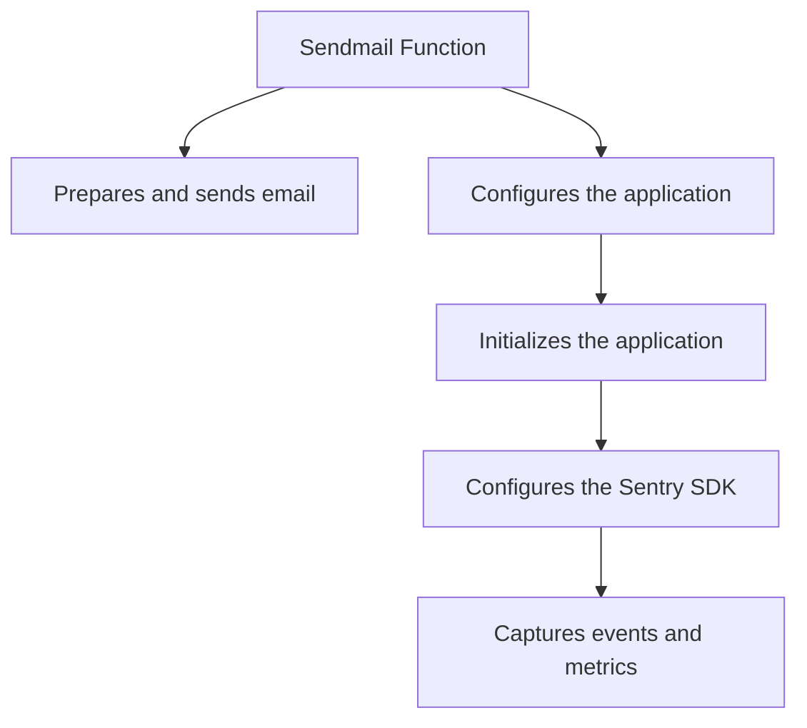

This document will cover the 'Sendmail Flow' feature of the Sentry-Demo application. We'll cover:

1. The purpose of the Sendmail Flow
2. The process of preparing and sending an email
3. The configuration and initialization of the application for the Sendmail Flow
4. The process of capturing events and metrics.

Technical document: <SwmLink doc-title="Understanding Sendmail Flow">[Understanding Sendmail Flow](/.swm/understanding-sendmail-flow.tvxpqyzi.sw.md)</SwmLink>

# Purpose of the Sendmail Flow

The Sendmail Flow is a feature of the Sentry-Demo application that enables the sending of emails from the default notification mail address. This feature is crucial for communicating with users, sending notifications, and providing updates.

# Preparing and Sending an Email

The process of preparing and sending an email involves several steps. First, the email content is parsed into a message object. Then, the headers, reply-to address, and body are extracted from the message. Finally, the email is sent using the send_mail function. This process ensures that the email is properly formatted and sent to the intended recipients.

# Configuring and Initializing the Application

Before the Sendmail Flow can be executed, the application needs to be configured and initialized. This involves setting up the environment, validating configurations, and initializing various services. This setup process ensures that the application is ready to execute the Sendmail Flow and send emails.

# Capturing Events and Metrics

As part of the Sendmail Flow, events and metrics are captured. This involves checking certain settings and filtering out specific items. The captured data provides valuable insights into the performance and usage of the Sendmail Flow, which can be used for optimization and improvement purposes.

&nbsp;

*This is an auto-generated document by Swimm AI 🌊 and has not yet been verified by a human*

<SwmMeta version="3.0.0" repo-id="Z2l0aHViJTNBJTNBc2VudHJ5LWRlbW8lM0ElM0FTd2ltbS1EZW1v" repo-name="sentry-demo" doc-type="product-flows">Powered by [Swimm](/)</SwmMeta>
