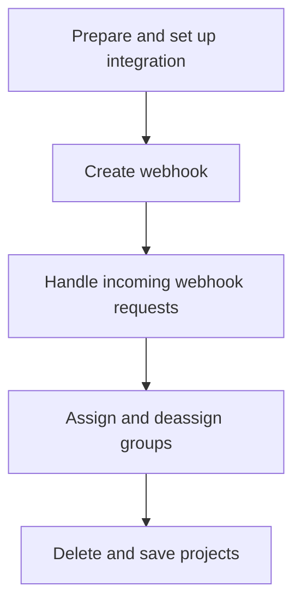

This document will cover the process of setting up an integration in the Sentry application, specifically focusing on the 'build_integration' process. We'll cover:

1. Preparing and setting up an integration
2. Creating a webhook
3. Handling incoming webhook requests
4. Assigning and deassigning groups
5. Deleting and saving projects.

Technical document: <SwmLink doc-title="Understanding the build_integration Process">[Understanding the build_integration Process](/.swm/understanding-the-build_integration-process.qz3a4y34.sw.md)</SwmLink>

# Preparing and setting up an integration

The process begins with the 'build_integration' function, which prepares the integration data and generates a webhook secret. This function is the starting point of the flow. It prepares the integration data, generates a webhook secret, and calls the 'create_webhook' function to create a webhook before the integration record exists. This is done to ensure that if the webhook creation fails, we don't persist a broken integration.

# Creating a webhook

The 'create_webhook' function creates a JiraServerSetupClient and attempts to create an issue webhook via the 'create_issue_webhook' function. If the webhook creation fails, it logs the error and raises an IntegrationError. This is to ensure that any issues with the webhook creation are properly logged and handled.

# Handling incoming webhook requests

The 'post' function handles the incoming webhook request. It validates the token, extracts the data from the request, and calls the 'handle_assignee_change' function if the assignee has changed. This is to ensure that any changes to the assignee are properly handled and reflected in the system.

# Assigning and deassigning groups

The 'sync_group_assignee_inbound' function assigns linked groups to matching users. If assign is False, it deassigns the group. If assign is True, it assigns the group to the user. This is done to ensure that the correct groups are assigned to the correct users. The 'deassign' function is responsible for removing the assignment of a group. It first checks if there is a previous assignee for the group and deletes it. Then, it creates an activity for the unassigned group and records the group history. It also invalidates the assignee cache for the deassigned group and syncs the Sentry assignee to external issues if the feature is enabled.

# Deleting and saving projects

The 'delete' function is used to delete a project. Since there is no foreign key relationship, we have to manually cascade. The function also removes notification settings for the project. This is done to ensure that all related data is properly removed when a project is deleted. The 'save' function is used to save a project. If the project doesn't have a slug, it generates one. If 'SENTRY_USE_SNOWFLAKE' is set, it saves the project with a snowflake id. This is done to ensure that the project is properly saved and can be retrieved later.

&nbsp;

*This is an auto-generated document by Swimm AI 🌊 and has not yet been verified by a human*

<SwmMeta version="3.0.0" repo-id="Z2l0aHViJTNBJTNBc2VudHJ5LWRlbW8lM0ElM0FTd2ltbS1EZW1v" repo-name="sentry-demo" doc-type="product-flows">Powered by [Swimm](/)</SwmMeta>
