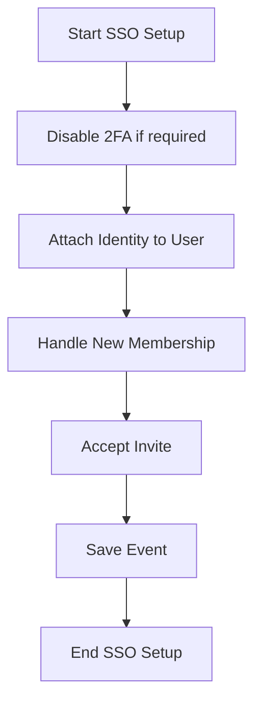

This document will cover the process of setting up Single Sign-On (SSO) for an organization in Sentry. We'll cover:

1. The purpose of the setup process
2. How 2FA is disabled during setup
3. How an identity is attached to a user
4. How new memberships are handled
5. How invites are accepted
6. How the event is saved.

Technical document: <SwmLink doc-title="Understanding the _finish_setup_pipeline Flow">[Understanding the \_finish_setup_pipeline Flow](/.swm/understanding-the-_finish_setup_pipeline-flow.e3sly3lv.sw.md)</SwmLink>

# Purpose of the SSO Setup Process

The SSO setup process in Sentry is responsible for configuring SSO for an organization. It does this by creating an authentication provider and linking an OrgMember identity to the active user. If the user is not authenticated or there is a user ID mismatch, the process will return an error.

# Disabling 2FA During Setup

During the SSO setup process, if 2FA is required for the organization, it is disabled. This is because only SSO or 2FA can be enabled, not both. An audit entry is created to log this change.

# Attaching an Identity to a User

The setup process attaches or re-attaches an identity to an already authenticated user. If the user has an existing identity, it is wiped out and a new identifier is used. If the user is a member of an organization, a linked flag is set for the member.

# Handling New Memberships

The setup process handles the creation of a new membership. It records an audit log for the new member addition.

# Accepting Invites

The setup process accepts an existing invite for the user for the organization. If SSO is required, it checks for a valid AuthIdentity. It then sets the user for the organization member and schedules a signal.

# Saving the Event

The setup process saves the event into the eventstream after normalizing and processing it. It also saves adjacent models such as releases and environments to postgres.

&nbsp;

*This is an auto-generated document by Swimm AI 🌊 and has not yet been verified by a human*

<SwmMeta version="3.0.0" repo-id="Z2l0aHViJTNBJTNBc2VudHJ5LWRlbW8lM0ElM0FTd2ltbS1EZW1v" repo-name="sentry-demo" doc-type="product-flows">Powered by [Swimm](/)</SwmMeta>
