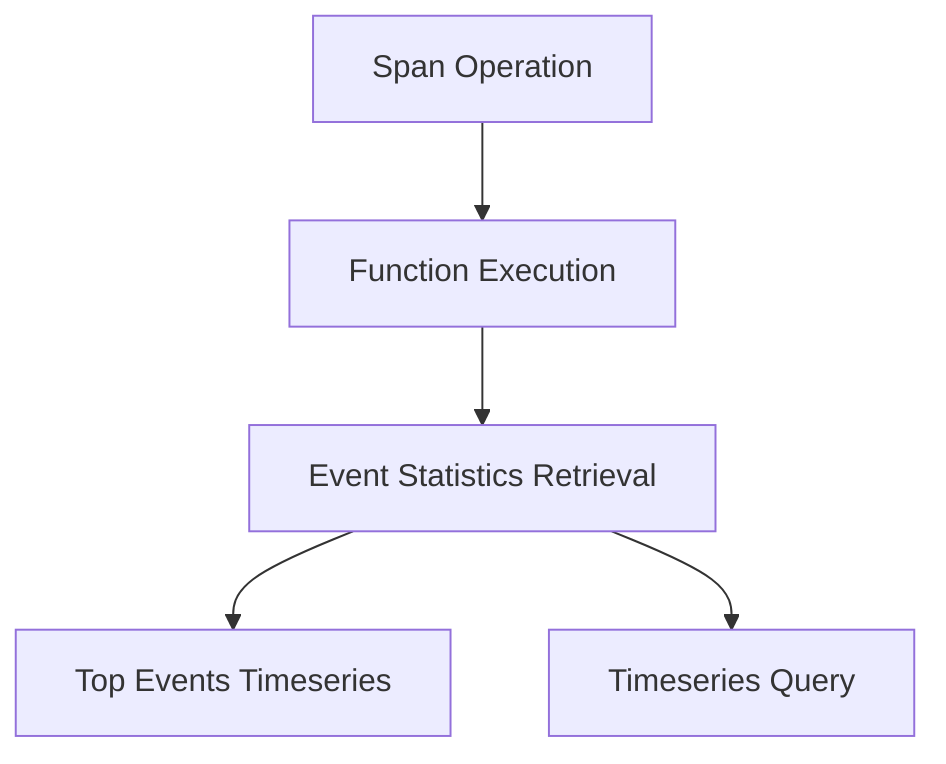

This document will cover the 'Span Operations' feature in Sentry. We'll cover:

1. What is a Span Operation
2. How Span Operations are executed
3. How Event Statistics are retrieved
4. How Top Events Timeseries are generated
5. How Timeseries Queries are performed

Technical document: <SwmLink doc-title="Understanding Span Operations">[Understanding Span Operations](/.swm/understanding-span-operations.8aakc4di.sw.md)</SwmLink>

# What is a Span Operation

A Span Operation is a process that wraps around a CallableStrategy function. It checks if the operation name of a span is in the list of permitted operations. If it is, it executes the function with the span as an argument. If not, it returns None. This process is crucial in ensuring that only permitted operations are executed, enhancing the security and efficiency of the system.

# How Span Operations are executed

The execution of Span Operations is handled by a complex function that performs various operations based on the input parameters. It primarily fetches event statistics. However, it also handles various edge cases, such as when the metrics are enhanced and a dashboard widget ID is provided, or when there are errors in the original results. This ensures that the system can handle a variety of scenarios and provide accurate and relevant data.

# How Event Statistics are retrieved

Event Statistics are retrieved by a function that checks if there are top events. If there are, it calls another function to generate a timeseries for a limited number of top events. If not, it performs a timeseries query. This process ensures that the system can provide detailed and relevant statistics for events.

# How Top Events Timeseries are generated

The generation of Top Events Timeseries is done by a function that performs a timeseries query for a limited number of top events. It returns a dictionary of objects that have been zerofilled in case of gaps. This ensures that the system can provide a comprehensive and accurate representation of the top events over time.

# How Timeseries Queries are performed

Timeseries Queries are performed by a function that runs arbitrary user timeseries queries against events. It uses a builder to run the query and process the results. This ensures that the system can handle a variety of queries and provide accurate and relevant data.

&nbsp;

*This is an auto-generated document by Swimm AI 🌊 and has not yet been verified by a human*

<SwmMeta version="3.0.0" repo-id="Z2l0aHViJTNBJTNBc2VudHJ5LWRlbW8lM0ElM0FTd2ltbS1EZW1v" repo-name="sentry-demo" doc-type="product-flows">Powered by [Swimm](/)</SwmMeta>
