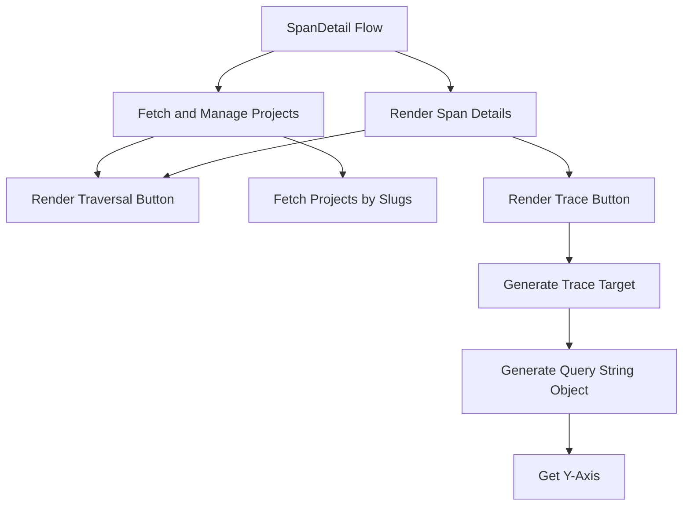

This document will cover the 'SpanDetail Flow' feature of the Sentry application. We'll cover:

1. The purpose of the SpanDetail Flow
2. The process of fetching and managing projects
3. The functionality of the Traversal Button
4. The process of fetching projects by their slugs
5. The rendering of Span Details
6. The functionality of the Trace Button
7. The generation of Trace Target
8. The generation of Query String Object for the event view.

Technical document: <SwmLink doc-title="Understanding SpanDetail Flow">[Understanding SpanDetail Flow](/.swm/understanding-spandetail-flow.09h5xiyy.sw.md)</SwmLink>

# SpanDetail Flow

The SpanDetail Flow is a feature in Sentry that provides detailed information about a specific span. A span represents a set of timed operations in a transaction. This feature uses various pieces of state and props to determine what to render and includes several nested functions that render specific parts of the span detail view.

# Fetch and Manage Projects

The SpanDetail Flow uses a hook called 'useProjects' to fetch and manage the state of projects from the ProjectsStore. This provides a way to select specific project slugs, and search for more projects that may not be in the project store.

# Render Traversal Button

Within the SpanDetail Flow, there is a function called 'renderTraversalButton' that renders a button for traversing child transactions of a span. If there are no child transactions, a loading indicator is displayed. If there are child transactions, a button is rendered that links to the EventView of the child transactions.

# Fetch Projects by Slugs

The 'useProjects' hook contains a function called 'loadProjectsBySlug' that fetches projects by their slugs. It updates the state of the 'useProjects' hook to indicate that it's fetching projects, then makes a request to fetch the projects. If the request is successful, the fetched projects are added to the ProjectsStore and the state is updated to indicate that the fetch was successful.

# Render Span Details

The 'renderSpanDetails' function is the main function in the SpanDetail flow. It takes in a span, event, organization, and other properties from the props. It checks if the span is a gap span and renders different components based on that. It also calculates the duration of the span and filters out hidden and raw span keys. It then renders a table with various details about the span.

# Render Trace Button

The 'renderTraceButton' function is also called within 'renderSpanDetails'. It works similarly to 'renderTraversalButton', but it creates an EventView for the trace of the span instead of the child transactions.

# Generate Trace Target

The 'generateTraceTarget' function generates a target for the trace. It first checks if the organization has the 'performance-view' feature. If it does, it calls the 'getTraceDetailsUrl' function. If not, it creates an EventView object and calls the 'getResultsViewUrlTarget' method on it.

# Generate Query String Object

The 'generateQueryStringObject' method generates a query string object for the event view. It includes various properties such as id, name, field, sort, environment, project, query, yAxis, dataset, display, topEvents, and interval.

# Get Y-Axis

The 'getYAxis' method is the final step in the flow. It returns the yAxis value for the event view. If the yAxis value is not set, it returns the default option.

&nbsp;

*This is an auto-generated document by Swimm AI 🌊 and has not yet been verified by a human*

<SwmMeta version="3.0.0" repo-id="Z2l0aHViJTNBJTNBc2VudHJ5LWRlbW8lM0ElM0FTd2ltbS1EZW1v" repo-name="sentry-demo" doc-type="product-flows">Powered by [Swimm](/)</SwmMeta>
