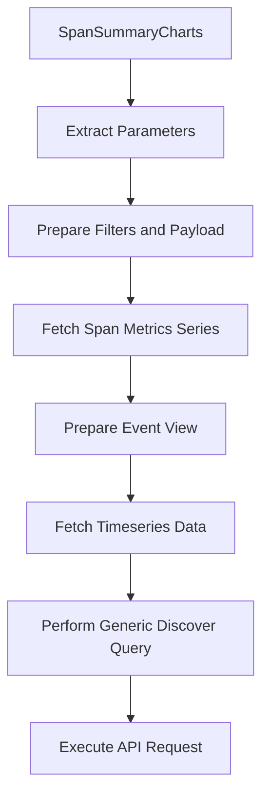

This document will cover the SpanSummaryCharts feature in Sentry, which includes:

1. Extracting necessary parameters
2. Preparing filters and request payload for the span metrics series
3. Fetching the span metrics series
4. Preparing the event view for the discover series
5. Fetching the timeseries data
6. Performing a generic discover query
7. Executing the actual API request.

Technical document: <SwmLink doc-title="Understanding SpanSummaryCharts">[Understanding SpanSummaryCharts](/.swm/understanding-spansummarycharts.fao3ydj6.sw.md)</SwmLink>

# Extracting Necessary Parameters

The SpanSummaryCharts feature begins by extracting necessary parameters from the URL and query string. This is essential to identify the specific span metrics data that the user wants to view.

# Preparing Filters and Request Payload

Once the necessary parameters are extracted, they are used to prepare filters and a request payload for the span metrics series. This step ensures that the correct data is fetched based on the user's request.

# Fetching the Span Metrics Series

The span metrics series is fetched using a custom function. This function sets the dataset to SPANS_METRICS and passes the options and referrer to another function.

# Preparing the Event View

The event view for the discover series is prepared using another custom function. This function gets the event view based on the provided options and page filters.

# Fetching the Timeseries Data

The timeseries data is fetched using a custom function. This function prepares the request payload and invokes another function with the appropriate parameters. The result of this function is then processed and returned.

# Performing a Generic Discover Query

A generic discover query is performed using a custom function. This function prepares the API payload and then performs the query. The result of the query is then returned.

# Executing the Actual API Request

The actual API request is performed by a function. If a certain option is provided, it uses a batch request function to perform the request. Otherwise, it performs the request directly.

&nbsp;

*This is an auto-generated document by Swimm AI 🌊 and has not yet been verified by a human*

<SwmMeta version="3.0.0" repo-id="Z2l0aHViJTNBJTNBc2VudHJ5LWRlbW8lM0ElM0FTd2ltbS1EZW1v" repo-name="sentry-demo" doc-type="product-flows">Powered by [Swimm](/)</SwmMeta>
