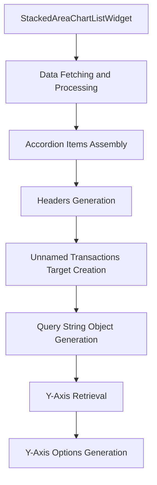

This document will provide a detailed understanding of the StackedAreaChartListWidget feature in the Sentry application. We'll cover:

1. The purpose of the StackedAreaChartListWidget
2. How data is fetched and processed for the widget
3. The assembly of accordion items
4. The generation of headers for accordion items
5. The creation of unnamed transactions target
6. The generation of query string object
7. The retrieval of Y-Axis
8. The generation of Y-Axis options.

Technical document: <SwmLink doc-title="Understanding the StackedAreaChartListWidget">[Understanding the StackedAreaChartListWidget](/.swm/understanding-the-stackedareachartlistwidget.t5bi78l7.sw.md)</SwmLink>

# Purpose of the StackedAreaChartListWidget

The StackedAreaChartListWidget is a component that displays a stacked area chart. It is designed to visualize data in a way that allows for easy comparison of different data sets over time. The widget is composed of several parts, each responsible for a specific task.

# Data Fetching and Processing

The StackedAreaChartListWidget fetches and processes the data needed for the widget. The data fetching and processing is done in a way that ensures the data is up-to-date and accurate.

# Accordion Items Assembly

The widget assembles accordion items to display the data. This includes generating headers for the accordion items and mapping these headers to their corresponding content.

# Headers Generation

Headers for the accordion items are generated to provide a clear and concise description of the data being displayed. If the transaction is unparameterized, a target for the transaction is generated.

# Unnamed Transactions Target Creation

A Discover target for unnamed transactions is created. This involves constructing a new query and creating an EventView from the new query.

# Query String Object Generation

A query string object is created by gathering various properties of the current instance and combining them into an object. The yAxis property is set by either using the existing yAxis or retrieving a new one.

# Y-Axis Retrieval

The current yAxis value is retrieved. If it doesn't exist, it defaults to the first option from the yAxis options. This ensures that the yAxis is always a valid option.

# Y-Axis Options Generation

A list of valid yAxis options is generated. This includes filtering out aggregates that are not graphable and mapping them into a format suitable for a select input. Some default options are also included.

&nbsp;

*This is an auto-generated document by Swimm AI 🌊 and has not yet been verified by a human*

<SwmMeta version="3.0.0" repo-id="Z2l0aHViJTNBJTNBc2VudHJ5LWRlbW8lM0ElM0FTd2ltbS1EZW1v" repo-name="sentry-demo" doc-type="product-flows">Powered by [Swimm](/)</SwmMeta>
