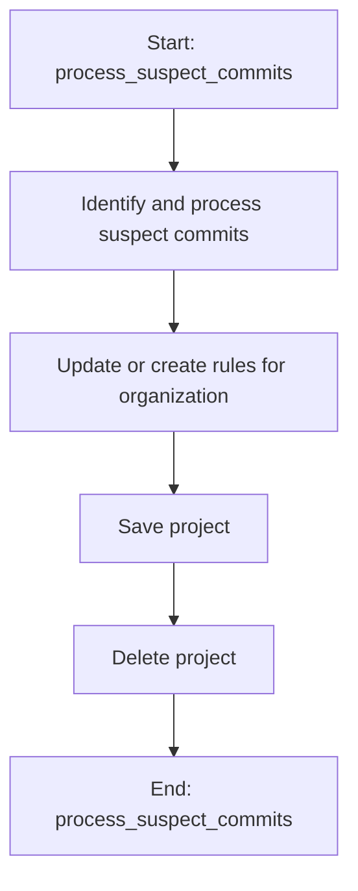

This document will cover the 'Suspect Commits Processing' feature in Sentry's error tracking and performance monitoring platform. We'll cover:

1. The purpose of the 'Suspect Commits Processing' feature
2. The process of identifying and processing suspect commits
3. The process of updating or creating rules for the organization
4. The process of saving and deleting projects

Technical document: <SwmLink doc-title="Understanding process_suspect_commits">[Understanding process_suspect_commits](/.swm/understanding-process_suspect_commits.8i6p8lxz.sw.md)</SwmLink>

# Purpose of the 'Suspect Commits Processing' Feature

The 'Suspect Commits Processing' feature is a part of Sentry's error tracking and performance monitoring platform. It is designed to identify and process suspect commits in a project. This feature helps in identifying the commits that might have introduced errors in the project, thereby aiding in debugging and error resolution.

# Identifying and Processing Suspect Commits

The process starts by acquiring a lock and then calling the main function with the provided arguments. The main function retrieves the project and group owners from the cache. If the number of owners is above a certain limit, it aborts the process. Otherwise, it retrieves the committers for the event and updates the group owners based on the committers' scores. The function that retrieves the committers processes the event frames and matches the commits to the file paths in the frames. It returns a list of authors and their associated commits.

# Updating or Creating Rules for the Organization

The function checks if a rule already exists for the organization. If it does, it updates the rule's end date, number of samples, and sample rate, and then saves the rule. If no rule exists, it creates a new one using the provided parameters, saves it, and assigns a rule id. If the id exceeds the maximum allowed rules, it deletes the rule and raises an exception.

# Saving and Deleting Projects

The function responsible for removing a project first removes the notification settings for the project and then saves the project in an outbox for update before deleting it. The function used to save the project generates a unique ID if the project doesn't have one and then tries to save the project. If there's an integrity error, it resets the project ID and raises an error.

&nbsp;

*This is an auto-generated document by Swimm AI 🌊 and has not yet been verified by a human*

<SwmMeta version="3.0.0" repo-id="Z2l0aHViJTNBJTNBc2VudHJ5LWRlbW8lM0ElM0FTd2ltbS1EZW1v" repo-name="sentry-demo" doc-type="product-flows">Powered by [Swimm](/)</SwmMeta>
