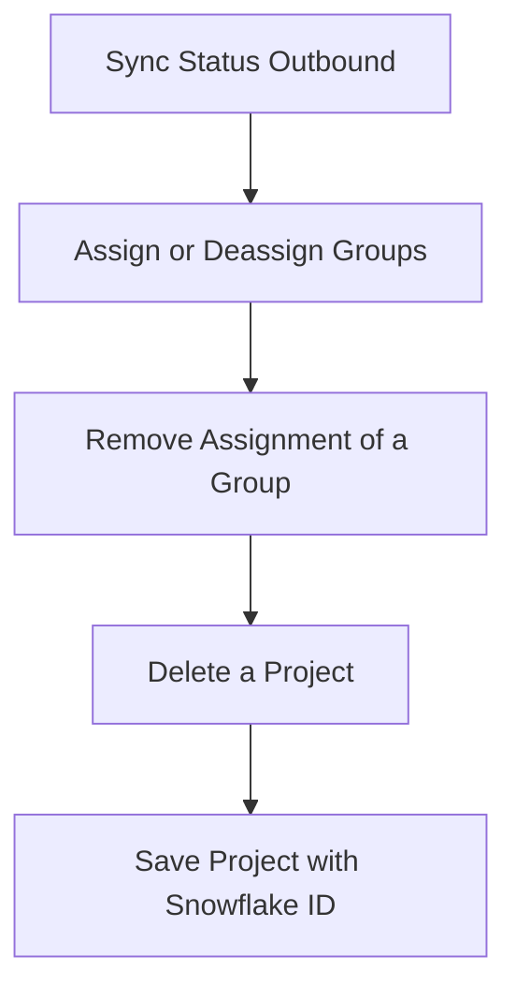

This document will cover the 'Sync Status Outbound' feature, which includes:

1. Propagating a Sentry issue's status to a linked issue's status.
2. Assigning or deassigning groups to users based on the `assign` parameter.
3. Removing the assignment of a group.
4. Deleting a project.
5. Saving a project with a snowflake ID.

Technical document: <SwmLink doc-title="Understanding sync_status_outbound">[Understanding sync_status_outbound](/.swm/understanding-sync_status_outbound.cyof7gyw.sw.md)</SwmLink>

# Propagating a Sentry issue's status to a linked issue's status

The 'Sync Status Outbound' function is responsible for propagating a Sentry issue's status to a linked issue's status. It first retrieves the Jira issue and project, then checks if the current status of the Jira issue matches the status in Sentry. If not, it fetches the available transitions for the Jira issue and applies the appropriate transition to match the status in Sentry.

# Assigning or deassigning groups to users

The 'Sync Group Assignee Inbound' function is responsible for assigning or deassigning groups to users based on the `assign` parameter. If `assign` is `True`, it assigns the groups to the user. If `assign` is `False`, it deassigns the groups from the user.

# Removing the assignment of a group

The 'Deassign' function is responsible for removing the assignment of a group. It first checks if there is a previous assignee for the group. If there is, it deletes the assignment and creates an activity log for the unassignment. It also invalidates the assignee cache for the group and debounces the issue owners evaluation cache.

# Deleting a project

The 'Delete' function is used to delete a project. It manually cascades the deletion due to the lack of a foreign key relationship. It also removes notification settings for the project.

# Saving a project with a snowflake ID

The 'Save with Snowflake ID' function is used to save an instance with a snowflake ID. It generates a new snowflake ID if the instance does not have one and then attempts to save the instance.

&nbsp;

*This is an auto-generated document by Swimm AI 🌊 and has not yet been verified by a human*

<SwmMeta version="3.0.0" repo-id="Z2l0aHViJTNBJTNBc2VudHJ5LWRlbW8lM0ElM0FTd2ltbS1EZW1v" repo-name="sentry-demo" doc-type="product-flows">Powered by [Swimm](/)</SwmMeta>
