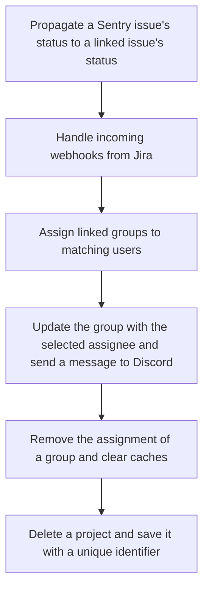

This document will cover the 'sync_status_outbound' flow, which includes:

1. Propagating a Sentry issue's status to a linked issue's status.
2. Handling incoming webhooks from Jira.
3. Assigning linked groups to matching users.
4. Updating the group with the selected assignee and sending a message to Discord.
5. Removing the assignment of a group and clearing caches.
6. Deleting a project and saving it with a unique identifier.

Technical document: <SwmLink doc-title="sync_status_outbound flow">[sync_status_outbound flow](/.swm/sync_status_outbound-flow.4qxwnwrm.sw.md)</SwmLink>

# Propagate a Sentry issue's status to a linked issue's status

The 'sync_status_outbound' function is responsible for propagating a Sentry issue's status to a linked issue's status. It fetches the issue from Jira and checks if the status needs to be updated. If so, it fetches the possible transitions for the issue and applies the appropriate one.

# Handle incoming webhooks from Jira

The 'post' function handles incoming webhooks from Jira. It validates the token, parses the request data, and calls the 'handle_assignee_change' function if the assignee has changed.

# Assign linked groups to matching users

The 'sync_group_assignee_inbound' function assigns linked groups to matching users. It checks project membership and returns a list of groups that were successfully assigned.

# Update the group with the selected assignee and send a message to Discord

The 'assign' function updates the group with the selected assignee and sends a message to Discord indicating that the assignee has been updated.

# Remove the assignment of a group and clear caches

The 'deassign' function is responsible for removing the assignment of a group. It first checks if there is a previous assignee for the group and if so, it deletes the assignment. It then creates an activity for the unassigned group and records the group history. The function also invalidates the assignee cache for the deassigned group and syncs the Sentry assignee to external issues.

# Delete a project and save it with a unique identifier

The 'delete' function is used to delete a project. It manually cascades the deletion due to the absence of a foreign key relationship. It also removes notification settings for the project. The 'save' function is used to save a project. If the project doesn't have a slug, it generates one. If the 'SENTRY_USE_SNOWFLAKE' setting is enabled, it saves the project with a snowflake id.

&nbsp;

*This is an auto-generated document by Swimm AI 🌊 and has not yet been verified by a human*

<SwmMeta version="3.0.0" repo-id="Z2l0aHViJTNBJTNBc2VudHJ5LWRlbW8lM0ElM0FTd2ltbS1EZW1v" repo-name="sentry-demo" doc-type="product-flows">Powered by [Swimm](/)</SwmMeta>
