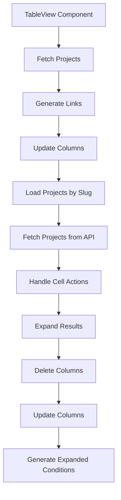

This document will provide a detailed understanding of the TableView Component in the Sentry application. We'll cover:

 1. Overview of TableView Component
 2. Fetching Projects
 3. Generating Links
 4. Updating Columns
 5. Loading Projects by Slug
 6. Fetching Projects from API
 7. Handling Cell Actions
 8. Expanding Results
 9. Deleting Columns
10. Updating Columns
11. Generating Expanded Conditions

Technical document: <SwmLink doc-title="Understanding TableView Component">[Understanding TableView Component](/.swm/understanding-tableview-component.7tg8pc8a.sw.md)</SwmLink>

# Overview of TableView Component

The TableView component is a crucial part of the Sentry application. It displays data in a tabular format, providing a clear and organized view of the data. The component fetches and manipulates data using several hooks and helper functions. It also handles user interactions such as column resizing, cell actions, and column updates, ensuring a smooth and interactive user experience.

# Fetching Projects

The TableView uses a hook called 'useProjects' to fetch projects from the ProjectsStore. This hook allows the TableView to select specific project slugs and search for more projects that may not be in the project store. It also handles loading and error states, ensuring that the TableView is always updated with the latest project data.

# Generating Links

The TableView uses a function called 'generateLinkToEventInTraceView' to generate URLs. These URLs lead to the trace view or the event details view, depending on the feature flag. This function considers various parameters such as organization, location, spanId, projectSlug, timestamp, traceSlug, eventId, transactionName, eventView, and others to generate the appropriate URL.

# Updating Columns

The TableView uses a method called 'withColumns' to create a new EventView with the specified columns. This method handles the resizing of columns and updates the sort fields if sorted fields have been removed. This ensures that the TableView always displays the most relevant and organized data to the user.

# Loading Projects by Slug

The 'loadProjectsBySlug' function is used within the 'useProjects' hook to load projects by their slugs. It fetches the projects from the API and updates the ProjectsStore and the state of the 'useProjects' hook. This ensures that the TableView is always updated with the latest project data.

# Fetching Projects from API

The 'fetchProjects' function is used within the 'loadProjectsBySlug' function to fetch projects from the API. It considers various parameters such as slugs, search, limit, lastSearch, and cursor. It also handles pagination, ensuring that all projects are fetched and displayed in the TableView.

# Handling Cell Actions

The 'handleCellAction' function is the entry point of the TableView flow. It handles different actions like 'RELEASE' and 'DRILLDOWN' based on the user's interaction with the table cells. In the case of 'DRILLDOWN', it calls the 'getExpandedResults' function. This ensures that the TableView responds appropriately to user interactions.

# Expanding Results

The 'getExpandedResults' function is used to convert an aggregated query into one that does not have aggregates. It also applies additional conditions and generates conditions based on the 'dataRow' parameter and the current fields in the 'eventView'. It then updates the columns according to the expansion and calls the 'withDeletedColumn' and 'withUpdatedColumn' methods. This ensures that the TableView always displays the most relevant and organized data to the user.

# Deleting Columns

The 'withDeletedColumn' method is used to remove a column from the event view. It checks for conditions like the removal of the orphan column and out-of-bounds. If the deleted column is one of the sorted columns, it removes it from the list of sorts. This ensures that the TableView always displays the most relevant and organized data to the user.

# Updating Columns

The 'withUpdatedColumn' method is used to update a column in the event view. If the updated column is one of the sorted columns, it may need to be removed from the list of sorts. This ensures that the TableView always displays the most relevant and organized data to the user.

# Generating Expanded Conditions

The 'generateExpandedConditions' function is used to generate additional conditions for the expanded results. It removes any aggregates from the search conditions and adds additional conditions provided and generated. This ensures that the TableView always displays the most relevant and organized data to the user.

&nbsp;

*This is an auto-generated document by Swimm AI 🌊 and has not yet been verified by a human*

<SwmMeta version="3.0.0" repo-id="Z2l0aHViJTNBJTNBc2VudHJ5LWRlbW8lM0ElM0FTd2ltbS1EZW1v" repo-name="sentry-demo" doc-type="product-flows">Powered by [Swimm](/)</SwmMeta>
