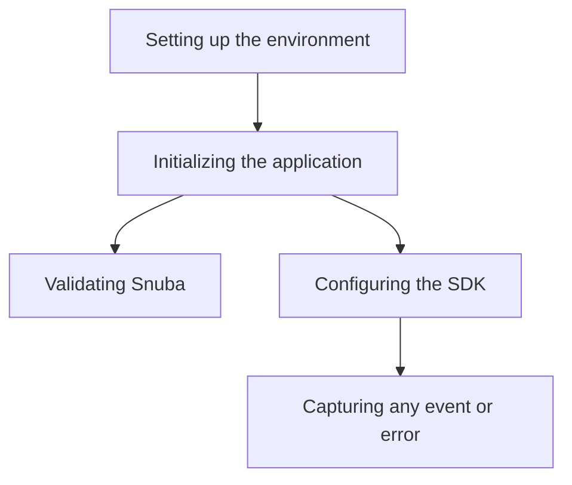

This document will cover the 'Testing Different LLM Providers' flow, which includes:

1. Setting up the environment
2. Initializing the application
3. Validating Snuba
4. Configuring the SDK
5. Capturing any event or error

Technical document: <SwmLink doc-title="Understanding the llm Flow">[Understanding the llm Flow](/.swm/understanding-the-llm-flow.0rg8ue1s.sw.md)</SwmLink>

# Setting up the environment

The environment is set up using two different configuration files. This process ensures that warnings are always displayed and additional mimetypes for static files are added. It also checks if the configuration file exists and if not, raises an exception.

# Initializing the application

The application is set up by configuring settings, validating configurations, and setting up services. This process also involves validating Snuba and configuring the SDK.

# Validating Snuba

The validation of Snuba ensures that everything related to Snuba is in sync. It checks if all Snuba required backends are set and if a Snuba compatible eventstream is configured. If not, it raises a ConfigurationError.

# Configuring the SDK

The SDK is set up by configuring the transport layer and capturing any events. This process also involves modifying the transport layer to add metrics for better resolution around events sent to the ingest, incrementing a metric to track the number of events and requests, retrieving the SDK configuration options, and capturing any event or error.

# Capturing any event or error

Any event or error is captured and sent to Sentry. This process involves incrementing a metric, creating a copy of the envelope with safe items only, displaying the context of a frame in the Sentry UI, and making a PUT request to send the incremented metric to the server.

&nbsp;

*This is an auto-generated document by Swimm AI 🌊 and has not yet been verified by a human*

<SwmMeta version="3.0.0" repo-id="Z2l0aHViJTNBJTNBc2VudHJ5LWRlbW8lM0ElM0FTd2ltbS1EZW1v" repo-name="sentry-demo" doc-type="product-flows">Powered by [Swimm](/)</SwmMeta>
