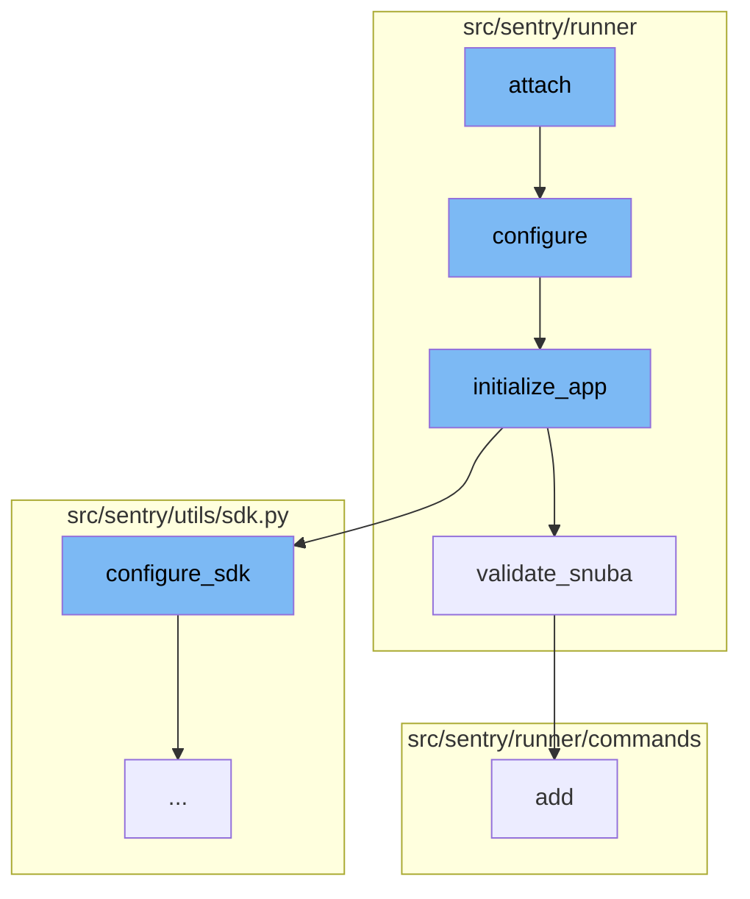

This document will cover the Attach Flow feature, which includes:

 1. Running a single devservice in the foreground
 2. Setting up the environment
 3. Setting up the application
 4. Validating Snuba
 5. Adding a permission to a user
 6. Setting up the Sentry SDK
 7. Patching the transport functions
 8. Incrementing a metric
 9. Getting the options for the Sentry SDK
10. Capturing any event or envelope and sending it to Sentry
11. Making a PUT request.

Technical document: <SwmLink doc-title="Understanding the Attach Flow">[Understanding the Attach Flow](/.swm/understanding-the-attach-flow.6swys4yu.sw.md)</SwmLink>

# Running a single devservice in the foreground

The Attach function is used to run a single devservice in the foreground. It accepts a single argument, the name of the service to spawn. The service will run with output printed to your terminal, and the ability to kill it with ^C. This is used in devserver.

# Setting up the environment

The Configure function is used to set up the environment given two different config files. It ensures that warnings are always displayed and adds in additional mimetypes that are useful for static files. It also checks if the configuration file exists and if not, it raises an exception.

# Setting up the application

The Initialize_app function is used to set up the application. It configures the settings, validates the regions, options, and snuba, configures the SDK, and sets up the services. It also dynamically sets the CSRF_TRUSTED_ORIGINS for self-hosted settings.

# Validating Snuba

The Validate_snuba function ensures that everything related to Snuba is in sync. It checks if all Snuba required backends are present and if the eventstream is Snuba. If not, it raises a ConfigurationError.

# Adding a permission to a user

The Add function is used to add a permission to a user. It creates a UserPermission object for the user with the given permission. If the permission already exists for the user, it echoes a message stating the same.

# Setting up the Sentry SDK

The Configure_sdk function is the starting point of the flow. It sets up the Sentry SDK with the necessary configurations. It also defines the MultiplexingTransport class which is responsible for capturing events and envelopes, and recording lost events.

# Patching the transport functions

The Patch_transport_for_instrumentation function is called within Configure_sdk. It patches the transport functions to add metrics for better resolution around events sent to Sentry's ingest. It does this by wrapping the original \_send_request method of the transport with a new method that increments a metric before calling the original method.

# Incrementing a metric

The Incr function is used to increment a metric. It is called within Patch_transport_for_instrumentation and Configure_sdk to track the number of events and envelopes captured, and the number of requests sent.

# Getting the options for the Sentry SDK

The \_get_sdk_options function is called within Configure_sdk to get the options for the Sentry SDK. These options include the DSNs for Sentry and Relay, and various settings for transactions and events.

# Capturing any event or envelope and sending it to Sentry

The \_capture_anything method is part of the MultiplexingTransport class defined in Configure_sdk. It is responsible for capturing any event or envelope and sending it to Sentry.

# Making a PUT request

The Put function is used to make a PUT request. It's a part of the Sentry API client and is used to update resources on the server.

&nbsp;

*This is an auto-generated document by Swimm AI 🌊 and has not yet been verified by a human*

<SwmMeta version="3.0.0" repo-id="Z2l0aHViJTNBJTNBc2VudHJ5LWRlbW8lM0ElM0FTd2ltbS1EZW1v" repo-name="sentry-demo" doc-type="product-flows">Powered by [Swimm](/)</SwmMeta>
