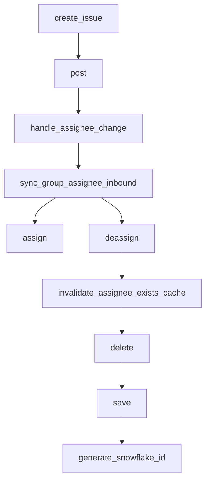

This document will cover the 'Create Issue' process in Sentry, which includes:

1. Overview of the 'Create Issue' process
2. Assignee Change
3. Synchronizing Group Assignee
4. Assigning the Issue
5. Deassigning the Issue
6. Invalidate Assignee Exists Cache
7. Deleting and Saving the Project
8. Generate Snowflake ID.

Technical document: <SwmLink doc-title="create_issue">[create_issue](/.swm/understanding-the-create_issue-process.8dsjnvpw.sw.md)</SwmLink>

# Overview of the 'Create Issue' process

The 'Create Issue' process is a series of steps that takes place when an issue is created in the Sentry application. The process begins with the 'create_issue' function, which prepares the data for the issue and makes a POST request. The data is then processed by the 'post' function, which clears any existing tags and context, validates the token, and processes the data from the request. If the data contains a 'changelog', the 'handle_assignee_change' function is called.

# Assignee Change

The 'handle_assignee_change' function checks if the assignee has changed. If there is no assignee, it assumes the issue was unassigned and calls 'sync_group_assignee_inbound' with 'assign=False'. If there is an assignee, it retrieves the assignee's email and calls 'sync_group_assignee_inbound' with 'assign=True'.

# Synchronizing Group Assignee

'sync_group_assignee_inbound' assigns linked groups to matching users. If 'assign' is 'False', it deassigns the group. If 'assign' is 'True', it assigns the group to the user.

# Assigning the Issue

The 'assign' function updates the group with the selected assignee and records the assignment in the analytics. It then sends a message indicating that the assignee has been updated.

# Deassigning the Issue

The 'deassign' function is responsible for removing the assignee from a group. It first checks if there is a previous assignee for the group and if so, it removes the assignee. It also creates an activity log for the unassignment and records the group history. It then clears the ownership cache for the deassigned group.

# Invalidate Assignee Exists Cache

The 'invalidate_assignee_exists_cache' function is used to clear the assignee exists cache. If a 'group_id' is provided, the cache for that specific group is cleared. Otherwise, the cache for all groups within a project that had an event within the 'ASSIGNEE_EXISTS_DURATION' window is cleared.

# Deleting and Saving the Project

The 'delete' function is used to delete a project. It manually cascades the deletion due to the lack of a foreign key relationship. It also removes notification settings for the project. The 'save' function is used to save a project. If the project does not have a slug, it generates one. If the 'SENTRY_USE_SNOWFLAKE' setting is enabled, it saves the project with a snowflake ID.

# Generate Snowflake ID

The 'generate_snowflake_id' function is used to generate a snowflake ID. It generates a unique ID based on the current time, region, and a sequence value from Redis.

&nbsp;

*This is an auto-generated document by Swimm AI 🌊 and has not yet been verified by a human*

<SwmMeta version="3.0.0" repo-id="Z2l0aHViJTNBJTNBc2VudHJ5LWRlbW8lM0ElM0FTd2ltbS1EZW1v" repo-name="sentry-demo" doc-type="product-flows">Powered by [Swimm](/)</SwmMeta>
