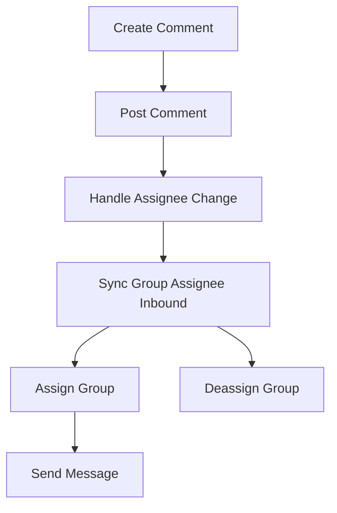

This document will cover the 'create_comment' process in the Sentry application. We'll cover:

1. The purpose of the 'create_comment' process
2. The steps involved in the 'create_comment' process
3. The impact of each step on the end user.

Technical document: <SwmLink doc-title="create_comment">[create_comment](/.swm/understanding-the-create_comment-process.rtr23qt3.sw.md)</SwmLink>

# Purpose of the 'create_comment' Process

The 'create_comment' process allows users to create and post comments on specific issues within the system. This feature enhances user interaction and collaboration, enabling users to discuss and provide feedback on issues.

# Steps Involved in the 'create_comment' Process

The process begins with the creation of a new comment on a specific issue. Once the comment is created, it is posted in the system. If the assignee of the issue has changed, the system handles this change and syncs the group assignee inbound. The system then assigns linked groups to matching users or deassigns the group if the assign parameter is set to False. Finally, a new follow-up message is sent indicating that the assignee has been updated.

# Impact of Each Step on the End User

Each step in the 'create_comment' process has a direct impact on the end user. The creation and posting of a comment allows the user to express their thoughts or feedback on an issue. The handling of assignee changes ensures that the correct users are associated with the issue. The assignment or deassignment of groups to users affects who is responsible for the issue. The sending of a follow-up message provides users with updates on the issue, keeping them informed of any changes.

&nbsp;

*This is an auto-generated document by Swimm AI 🌊 and has not yet been verified by a human*

<SwmMeta version="3.0.0" repo-id="Z2l0aHViJTNBJTNBc2VudHJ5LWRlbW8lM0ElM0FTd2ltbS1EZW1v" repo-name="sentry-demo" doc-type="product-flows">Powered by [Swimm](/)</SwmMeta>
