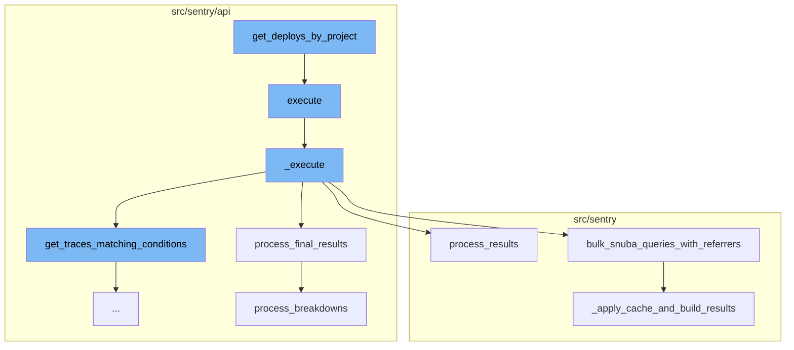

This document will cover the 'get_deploys_by_project' flow, which includes:

1. Retrieving deployment details for each project
2. Executing a series of queries to retrieve traces matching certain conditions
3. Processing the results of these queries
4. Applying caching to the results and building the final results.

Technical document: <SwmLink doc-title="Understanding the get_deploys_by_project Flow">[Understanding the get_deploys_by_project Flow](/.swm/understanding-the-get_deploys_by_project-flow.2u096ja7.sw.md)</SwmLink>

# Retrieving deployment details for each project

The 'get_deploys_by_project' function retrieves the deployment details for each project in a given list. It executes a SQL query to fetch the project_id, environment name, release version, and the date when the deployment finished. The results are then stored in a dictionary, with the project_id and environment name as keys.

# Executing a series of queries to retrieve traces

The 'execute' function calls the '\_execute' method and wraps its result in a dictionary under the key 'data'. The '\_execute' function retrieves traces matching certain conditions, refines the parameters based on the retrieved traces, and then performs a series of queries. The results of these queries are processed and returned as data.

# Processing the results of the queries

The 'process_final_results' function processes the results of the queries executed in the '\_execute' method. It sorts the spans, processes the breakdowns, and prepares the final data to be returned.

# Applying caching to the results and building the final results

The 'bulk_snuba_queries_with_referrers' function accepts a list of requests and referrers, and runs the requests on the appropriate endpoint. If caching is enabled, it checks the cache for results before running the queries. The '\_apply_cache_and_build_results' function applies caching to the results of the queries and builds the final results to be returned.

&nbsp;

*This is an auto-generated document by Swimm AI 🌊 and has not yet been verified by a human*

<SwmMeta version="3.0.0" repo-id="Z2l0aHViJTNBJTNBc2VudHJ5LWRlbW8lM0ElM0FTd2ltbS1EZW1v" repo-name="sentry-demo" doc-type="product-flows">Powered by [Swimm](/)</SwmMeta>
