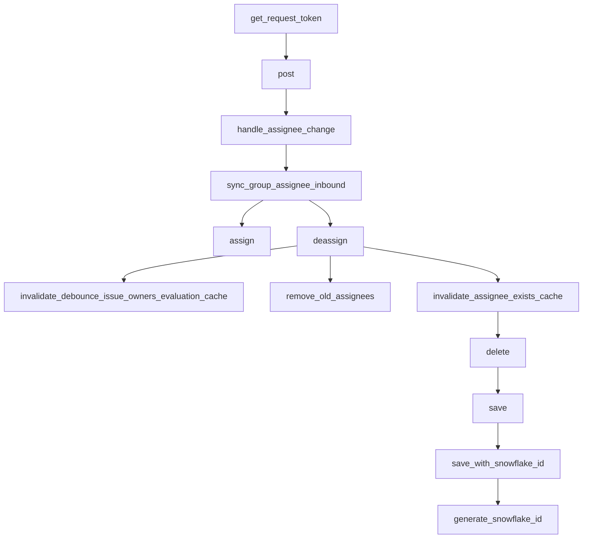

This document will cover the process of the 'get_request_token' flow in the Sentry application. We'll cover:

 1. The initial step of the OAuth flow
 2. Handling the incoming request
 3. Checking if the assignee field has changed
 4. Assigning linked groups to matching users
 5. Updating the group with the selected assignee
 6. Removing the assignment of a group
 7. Clearing the debounce issue owners cache
 8. Removing the old assignees of a group
 9. Clearing the assignee exists cache
10. Deleting a project
11. Saving a project with a snowflake id
12. Generating a snowflake id.

Technical document: <SwmLink doc-title="Understanding the get_request_token Flow">[Understanding the get_request_token Flow](/.swm/understanding-the-get_request_token-flow.dnqgpguu.sw.md)</SwmLink>

# Initial Step of the OAuth Flow

The process begins with the 'get_request_token' function, which is the initial step in the OAuth flow. This function retrieves a request token from a specified URL, which is then used to authenticate the user.

# Handling the Incoming Request

The 'post' function is called after 'get_request_token'. It handles the incoming request, clears any existing tags and context, and attempts to get the integration from the token. If the data contains a 'changelog', it calls the 'handle_assignee_change' function.

# Checking if the Assignee Field has Changed

The 'handle_assignee_change' function checks if the assignee field has changed. If there is no assignee, it assumes the issue was unassigned and calls the 'sync_group_assignee_inbound' function with assign set to False. If there is an assignee, it retrieves the assignee's email and calls the 'sync_group_assignee_inbound' function with assign set to True.

# Assigning Linked Groups to Matching Users

The 'sync_group_assignee_inbound' function assigns linked groups to matching users based on the provided email and external issue key. If assign is set to False, it deassigns the group.

# Updating the Group with the Selected Assignee

The 'assign' function is called if the 'sync_group_assignee_inbound' function was called with assign set to True. It updates the group with the selected assignee and sends a message indicating that the assignee was updated.

# Removing the Assignment of a Group

The 'deassign' function is used to remove the assignment of a group. It first checks if there is a previous assignee for the group and if so, it deletes the assignment. It then creates an activity for the unassignment and records the group history. It also invalidates the assignee cache for the group and syncs the Sentry assignee to external issues.

# Clearing the Debounce Issue Owners Cache

The 'invalidate_debounce_issue_owners_evaluation_cache' function is used to clear the debounce issue owners cache for a group or for all groups in a project that had an event within a certain time window. This is done to ensure that the issue owners are evaluated correctly.

# Removing the Old Assignees of a Group

The 'remove_old_assignees' function is used to remove the old assignees of a group. It checks if the previous assignee is a team and if so, it deletes the group subscription for the team. If the previous assignee is a user, it deletes the group subscription for the user.

# Clearing the Assignee Exists Cache

The 'invalidate_assignee_exists_cache' function is responsible for clearing the assignee exists cache. If a group id is provided, it clears the cache for that specific group. Otherwise, it clears the cache for all groups within a project that had an event within the 'ASSIGNEE_EXISTS_DURATION' window.

# Deleting a Project

The 'delete' function is used to delete a project. It first removes the notification settings for the project and then saves the project's outbox for update before deleting the project.

# Saving a Project with a Snowflake ID

The 'save' function is used to save a project. If the project does not have a slug, it generates one. If the 'SENTRY_USE_SNOWFLAKE' setting is enabled, it saves the project with a snowflake id using the 'save_with_snowflake_id' function.

# Generating a Snowflake ID

The 'generate_snowflake_id' function is used to generate a snowflake id. It first gets the segment values for the version id and region id. Then it calculates the time difference from the 'SENTRY_SNOWFLAKE_EPOCH_START' setting. Finally, it gets the sequence value from Redis and generates the snowflake id.

&nbsp;

*This is an auto-generated document by Swimm AI 🌊 and has not yet been verified by a human*

<SwmMeta version="3.0.0" repo-id="Z2l0aHViJTNBJTNBc2VudHJ5LWRlbW8lM0ElM0FTd2ltbS1EZW1v" repo-name="sentry-demo" doc-type="product-flows">Powered by [Swimm](/)</SwmMeta>
