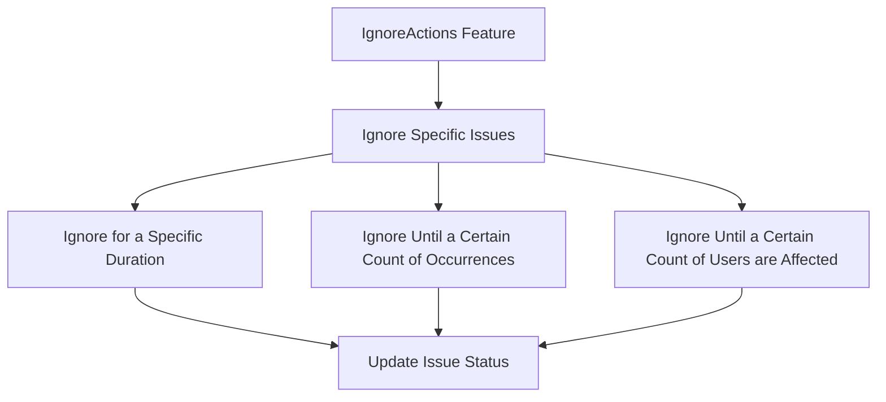

This document will explain the 'IgnoreActions' feature in the Sentry application. We'll cover:

1. What is the IgnoreActions feature
2. How users can ignore specific issues
3. The different options for ignoring issues
4. The process of updating the issue's status.

Technical document: <SwmLink doc-title="Understanding IgnoreActions">[Understanding IgnoreActions](/.swm/understanding-ignoreactions.hvbegr21.sw.md)</SwmLink>

# IgnoreActions Feature

The IgnoreActions feature is a tool within the Sentry application that allows users to ignore specific issues. This is particularly useful for developers who want to focus on the most critical issues first and deal with minor issues later.

# Ignoring Specific Issues

Users can choose to ignore specific issues within the application. This means that these issues will not appear in their issue feed until they decide to stop ignoring them. This can help to reduce clutter and allow users to focus on the most important issues.

# Ignore Options

There are several options for ignoring issues. Users can choose to ignore an issue for a specific duration, until a certain count of occurrences, or until a certain count of users are affected. This provides flexibility for users to manage their issues in a way that suits their needs.

# Updating Issue Status

Once a user decides to stop ignoring an issue, the issue's status is updated. This means that the issue will once again appear in their issue feed. The status update is done through a PUT request to the server, ensuring that the change is reflected in the database.

&nbsp;

*This is an auto-generated document by Swimm AI 🌊 and has not yet been verified by a human*

<SwmMeta version="3.0.0" repo-id="Z2l0aHViJTNBJTNBc2VudHJ5LWRlbW8lM0ElM0FTd2ltbS1EZW1v" repo-name="sentry-demo" doc-type="product-flows">Powered by [Swimm](/)</SwmMeta>
