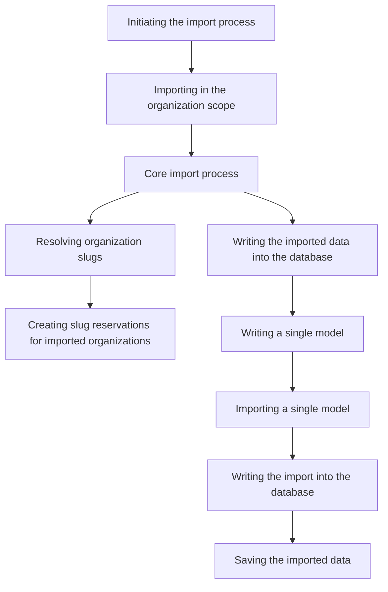

This document will cover the import process in the Sentry application. We'll cover:

 1. Initiating the import process
 2. Importing in the organization scope
 3. Core import process
 4. Writing the imported data into the database
 5. Resolving organization slugs
 6. Creating slug reservations for imported organizations
 7. Writing a single model
 8. Importing a single model
 9. Writing the import into the database
10. Saving the imported data

Technical document: <SwmLink doc-title="Understanding the Import Process">[Understanding the Import Process](/.swm/understanding-the-import-process.7hbk2wj1.sw.md)</SwmLink>

# Initiating the import process

The import process starts with the initiation of a relocation task. This task opens the relocation file and prepares the data for import. If an import breaks, it is abandoned rather than retried.

# Importing in the organization scope

The import process is performed in the organization scope, meaning that only models with user or organization relocation scopes are imported from the provided source file. The import process can be filtered by organization slug, allowing for selective import of organizations and users.

# Core import process

The core of the import process involves reading the content of the import file, processing it, and preparing it for writing into the database. This process also involves resolving organization slugs from the primary key map and creating organization slugs.

# Writing the imported data into the database

The imported data is written into the database by iterating over the models in the content and calling a function for each model to perform the write operation.

# Resolving organization slugs

Organization slugs for all imported organization models are resolved via the PrimaryKeyMap. The slugs are then reconciled globally by issuing a slug update.

# Creating slug reservations for imported organizations

Slug reservations are created for imported organizations that already exist on the region. These reservations are created in bulk and are used to prevent slug collisions.

# Writing a single model

The write operation for a single model is performed by retrieving the model's dependencies and using the ImportExportService to get the appropriate importer for the model.

# Importing a single model

A single model is imported by validating the input parameters, retrieving the model, and checking if it can be imported based on its silo mode. The JSON data is then deserialized into model instances and prepared for writing into the database.

# Writing the import into the database

The actual database write is performed by checking for potential collisions based on unique sets and handling them appropriately. If the model instance is new, it is saved to the database and its primary key is returned along with the Inserted flag. If the model instance already exists, it is either updated or its existing primary key is returned with the Existing flag, depending on the overwrite_configs flag.

# Saving the imported data

The final step in the import process is saving the imported data. This involves normalizing the event data, retrieving the project, and preparing the job data. Depending on the event type, the appropriate function is called to save the event data. Any potential collisions are handled and counters and frequencies are updated.

&nbsp;

*This is an auto-generated document by Swimm AI 🌊 and has not yet been verified by a human*

<SwmMeta version="3.0.0" repo-id="Z2l0aHViJTNBJTNBc2VudHJ5LWRlbW8lM0ElM0FTd2ltbS1EZW1v" repo-name="sentry-demo" doc-type="product-flows">Powered by [Swimm](/)</SwmMeta>
