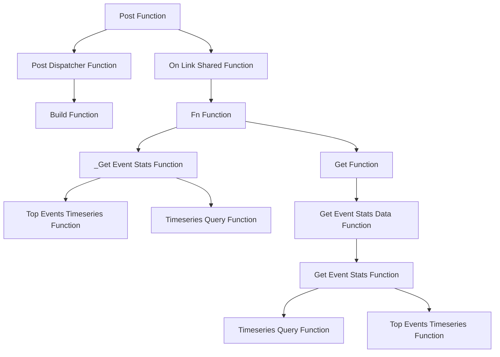

This document will cover the 'post' functionality in the sentry-demo repository, which is a crucial part of the event handling process. We'll cover:

1. The purpose of the 'post' functionality
2. The process of handling incoming requests
3. The routing of requests to appropriate handlers
4. The construction of Slack messages
5. The handling of shared links in Slack
6. The fetching of event statistics.

Technical document: <SwmLink doc-title="post">[post](/.swm/understanding-the-post-functionality.aska3eww.sw.md)</SwmLink>

# Post Function

The 'post' function serves as the entry point for handling requests. It validates the incoming request and routes it to the appropriate handler based on the type of the request. For instance, if the request type is 'link_shared', it triggers the 'on_link_shared' function.

# Post Dispatcher Function

The 'post_dispatcher' function handles Slack commands. It extracts the command and arguments from the request and dispatches them to the appropriate handler. If the command is not recognized, it responds with help text.

# Build Function

The 'build' function constructs the body of a Slack message. It uses information about an incident, such as its status and metric value, to create a formatted message with blocks of text and images.

# On Link Shared Function

The 'on_link_shared' function handles the event when a link is shared in Slack. It parses the shared link and determines its type. If the link is of type 'DISCOVER', it triggers an analytics record and prompts the user with the shared link.

# Fn Function

The 'fn' function fetches event statistics. It checks if the metrics are enhanced and if a dashboard widget ID is provided. If not, it calls the '\_get_event_stats' function. If yes, it fetches the widget and checks if it has a split. Depending on the split type, it modifies the query and dataset and calls the '\_get_event_stats' function.

# \_Get Event Stats Function

The '\_get_event_stats' function checks if there are top events. If yes, it calls the 'top_events_timeseries' function. If no, it calls the 'timeseries_query' function.

# Top Events Timeseries Function

The 'top_events_timeseries' function fetches the top events if not provided and then runs a query for each top event to fetch its timeseries data.

# Timeseries Query Function

The 'timeseries_query' function runs a timeseries query against events.

# Get Function

The 'get' function triggers the 'on_link_shared' function which then calls the 'fn' function. The 'fn' function is responsible for getting the event stats data by calling the 'get_event_stats_data' function.

# Get Event Stats Data Function

The 'get_event_stats_data' function gets the event stats data. It takes in several parameters including the request, organization, and a callable 'get_event_stats' function. This function executes the event stats query and returns the results.

# Get Event Stats Function

The 'get_event_stats' function gets the event stats. It does this by creating a 'ProfileTopFunctionsTimeseriesQueryBuilder' for each chunk of top functions and running a query for each builder. The results are then formatted and returned.

&nbsp;

*This is an auto-generated document by Swimm AI 🌊 and has not yet been verified by a human*

<SwmMeta version="3.0.0" repo-id="Z2l0aHViJTNBJTNBc2VudHJ5LWRlbW8lM0ElM0FTd2ltbS1EZW1v" repo-name="sentry-demo" doc-type="product-flows">Powered by [Swimm](/)</SwmMeta>
