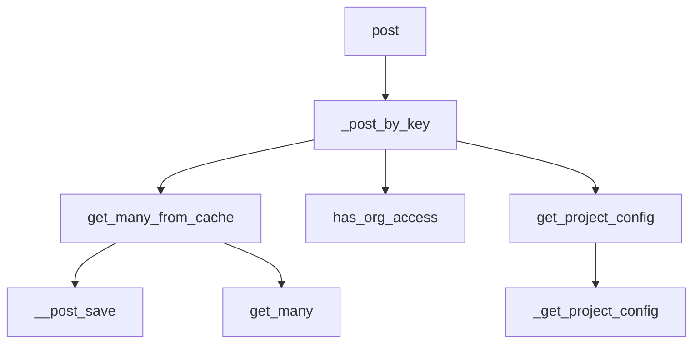

This document will cover the 'post' process in Sentry, which includes:

1. The purpose of the 'post' process
2. The flow of the 'post' process
3. The functions involved in the 'post' process and their roles

Technical document: <SwmLink doc-title="post">[post](/.swm/understanding-the-post-process.thyg7qam.sw.md)</SwmLink>

# Purpose of the 'post' Process

The 'post' process in Sentry is a multi-step flow that handles incoming requests and processes them based on their version. It starts with the 'post' function, which determines the version of the request and calls the appropriate function to process it.

# Flow of the 'post' Process

If the request version is '2' or '3', the '\_post_by_key' function is called. This function retrieves the public keys from the request, fetches the corresponding project keys from the cache, fetches the projects and organizations associated with these keys, and generates the project configurations. If the objects are not found in the cache, they are fetched from the database and the cache is updated. The 'has_org_access' function checks if the relay has access to the organization. If the relay is internal, it always has access. Otherwise, it checks if the relay's public key is in the organization's list of trusted relays. The 'get_option' function retrieves the value of an option for a project. If the option is not set for the project, it checks the project's template. After an instance is saved, the '\__post_save' function updates the cache with the changes made to the instance and removes any invalid cache entries. The 'get_many' function retrieves multiple values from the cache based on their keys. If the values are not found in the cache, they are fetched from the database and the cache is updated.

# Functions Involved in the 'post' Process

The 'post' function is the entry point for the flow. It handles the incoming request and determines the version of the request. Depending on the version, it either calls '\_post_or_schedule_by_key' or '\_post_by_project' to process the request. The '\_post_by_key' function is called when the request version is '2' or '3'. It retrieves the public keys from the request and fetches the corresponding project keys from the cache. It then fetches the projects and organizations associated with these keys. Finally, it generates the project configurations and updates the cache. The 'get_many_from_cache' function is used to fetch multiple objects from the cache based on their keys. If the objects are not found in the cache, it fetches them from the database and updates the cache. The 'has_org_access' function checks if the relay has access to the organization. If the relay is internal, it always has access. Otherwise, it checks if the relay's public key is in the organization's list of trusted relays. The 'get_option' function retrieves the value of an option for a project. If the option is not set for the project, it checks the project's template. The '\__post_save' function is called after an instance is saved. It updates the cache with the changes made to the instance and removes any invalid cache entries. The 'get_many' function retrieves multiple values from the cache based on their keys. If the values are not found in the cache, they are fetched from the database and the cache is updated.

&nbsp;

*This is an auto-generated document by Swimm AI 🌊 and has not yet been verified by a human*

<SwmMeta version="3.0.0" repo-id="Z2l0aHViJTNBJTNBc2VudHJ5LWRlbW8lM0ElM0FTd2ltbS1EZW1v" repo-name="sentry-demo" doc-type="product-flows">Powered by [Swimm](/)</SwmMeta>
