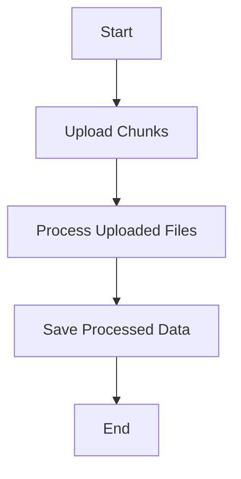

This document will cover the 'Post' process in the sentry-demo repository. We'll cover:

1. The purpose of the 'Post' process
2. The steps involved in the 'Post' process
3. The impact of each step on the end user.

Technical document: <SwmLink doc-title="Post">[Post](/.swm/understanding-the-post-process.h5wzjlri.sw.md)</SwmLink>

# Purpose of the 'Post' Process

The 'Post' process is a crucial part of the data handling and processing in the sentry-demo repository. It involves uploading chunks of data, processing these uploaded files, and saving the processed data. This process ensures that the data is correctly received, processed, and stored, enabling further operations on the data.

# Steps Involved in the 'Post' Process

The 'Post' process involves several steps. First, chunks of data are uploaded. These chunks are then processed, which involves validating the file size and the number of chunks, and handling the uploaded files. The processed data is then saved for future use. Each of these steps is crucial to ensure the integrity and availability of the data.

# Impact of Each Step on the End User

Each step in the 'Post' process has a direct impact on the end user. The upload of chunks ensures that the user's data is received by the system. The processing of the uploaded files validates the data, ensuring that it is correct and usable. Finally, saving the processed data ensures that the data is available for future use. This could involve displaying the data to the user, using the data in calculations, or any other operation that requires the data.

&nbsp;

*This is an auto-generated document by Swimm AI 🌊 and has not yet been verified by a human*

<SwmMeta version="3.0.0" repo-id="Z2l0aHViJTNBJTNBc2VudHJ5LWRlbW8lM0ElM0FTd2ltbS1EZW1v" repo-name="sentry-demo" doc-type="product-flows">Powered by [Swimm](/)</SwmMeta>
