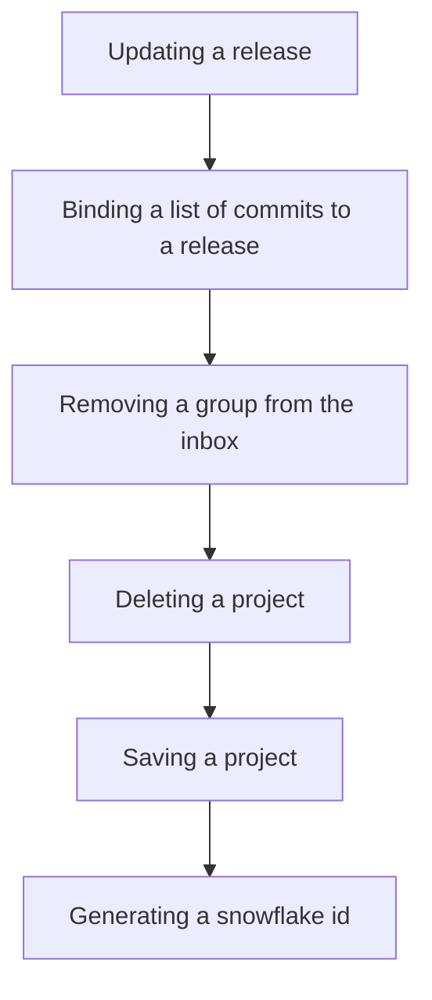

This document will cover the 'put' function in the Sentry application, which includes:

1. Updating a release
2. Binding a list of commits to a release
3. Removing a group from the inbox
4. Deleting a project
5. Saving a project
6. Generating a snowflake id.

Technical document: <SwmLink doc-title="put">[put](/.swm/understanding-the-put-function.ry88g6oo.sw.md)</SwmLink>

# Updating a release

The 'put' function is used to update a release. This can change some metadata associated with the release such as the ref, url, and dates. The function first binds the organization context and sets the version tag. It then tries to get the release and its associated projects. If the release does not exist, it raises a 'ResourceDoesNotExist' error. The function then checks if the user has permission to update the release. If not, it raises a 'ResourceDoesNotExist' error. The function then validates the data sent in the request. If the data is not valid, it returns a 400 response with the validation errors. If the data is valid, it updates the release with the new data.

# Binding a list of commits to a release

The 'set_commits' function is the starting point of the 'put' flow. It binds a list of commits to a release. It sorts the commit list in reverse order and then processes each commit. If a commit is not ignored by the 'RepositoryProvider', it is processed further. The function also handles the creation of 'Commit', 'CommitAuthor', 'ReleaseCommit', and 'ReleaseHeadCommit' objects.

# Removing a group from the inbox

The 'remove_group_from_inbox' function is the next step in the 'put' flow. It removes a group from the inbox. If the action is 'MARK_REVIEWED' and a user is provided, it creates an 'Activity' object and records the group history.

# Deleting a project

The 'delete' function is the third step in the 'put' flow. It removes notification settings for a project and then deletes the project.

# Saving a project

The 'save' function is the fourth step in the 'put' flow. It saves a project. If the project doesn't have a slug, it generates one. If 'SENTRY_USE_SNOWFLAKE' is true, it saves the project with a snowflake id.

# Generating a snowflake id

The 'generate_snowflake_id' function is the final step in the 'put' flow. It generates a snowflake id based on the current time and a sequence value from Redis.

&nbsp;

*This is an auto-generated document by Swimm AI 🌊 and has not yet been verified by a human*

<SwmMeta version="3.0.0" repo-id="Z2l0aHViJTNBJTNBc2VudHJ5LWRlbW8lM0ElM0FTd2ltbS1EZW1v" repo-name="sentry-demo" doc-type="product-flows">Powered by [Swimm](/)</SwmMeta>
