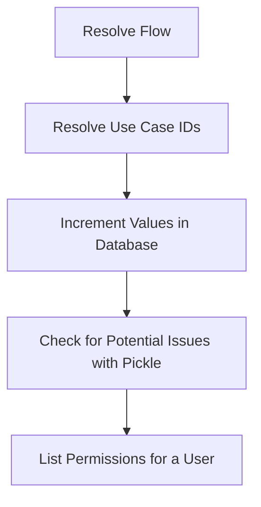

This document will cover the 'Resolve Flow' feature in Sentry, which includes:

1. The purpose of the Resolve Flow
2. The process of resolving use case IDs
3. The process of incrementing values in the database
4. The process of checking for potential issues with pickle
5. The process of listing permissions for a user.

Technical document: <SwmLink doc-title="Understanding the Resolve Flow">[Understanding the Resolve Flow](/.swm/understanding-the-resolve-flow.gcmd940v.sw.md)</SwmLink>

# Purpose of the Resolve Flow

The Resolve Flow is a key feature in Sentry that is responsible for resolving use case IDs. It takes a use case ID, an organization ID, and a string as parameters. The flow is initiated when these parameters are inputted.

# Resolving Use Case IDs

The process of resolving use case IDs involves checking if the use case is an instance of `UseCaseKey`. If it is, it is mapped to a `UseCaseID` using a specific mapping. This process is important for ensuring that the use case ID is in the correct format for further processing.

# Incrementing Values in the Database

Once the use case ID has been resolved, the next step in the Resolve Flow is to increment a value in the database. This is done by preparing the data and then processing the increment asynchronously. This process is crucial for updating the database with the latest data.

# Checking for Potential Issues with Pickle

The Resolve Flow also includes a step where it checks for potential issues with pickle. This involves checking each argument of the task for objects that should not be pickled. If an issue is detected, an error is raised. This step is important for ensuring the integrity and security of the data.

# Listing Permissions for a User

The final step in the Resolve Flow is to list the permissions for a user. This involves converting a user parameter to a user instance and then listing the permissions for that user. This step is crucial for managing user permissions and access control within Sentry.

&nbsp;

*This is an auto-generated document by Swimm AI 🌊 and has not yet been verified by a human*

<SwmMeta version="3.0.0" repo-id="Z2l0aHViJTNBJTNBc2VudHJ5LWRlbW8lM0ElM0FTd2ltbS1EZW1v" repo-name="sentry-demo" doc-type="product-flows">Powered by [Swimm](/)</SwmMeta>
