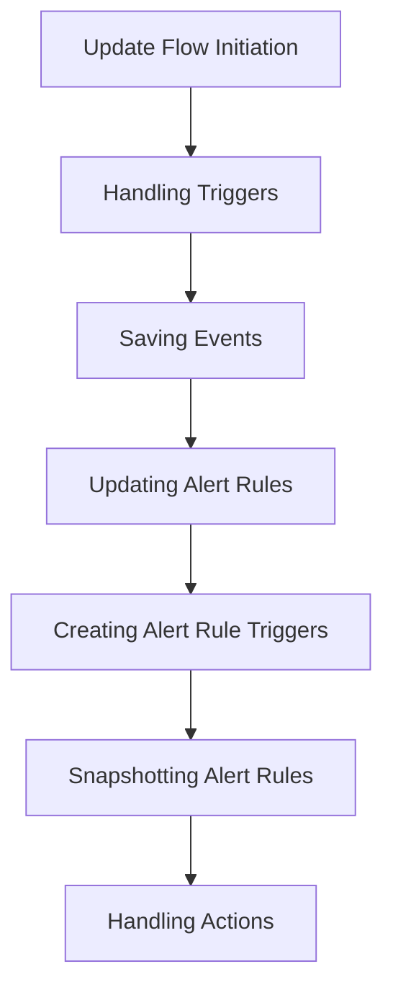

This document will cover the 'Update Flow' in Sentry, which includes:

1. The initiation of the update flow
2. Handling triggers
3. Saving events
4. Updating alert rules
5. Creating alert rule triggers
6. Snapshotting alert rules
7. Handling actions.

Technical document: <SwmLink doc-title="Understanding the Update Flow">[Understanding the Update Flow](/.swm/understanding-the-update-flow.fpjsd6qz.sw.md)</SwmLink>

# Update Flow Initiation

The update flow is initiated when an instance and validated data are provided. The system checks for 'triggers', 'id', and 'monitor_type' keys in the validated data. If found, these keys are removed from the validated data. The system then proceeds to update the alert rule and handle triggers.

# Handling Triggers

The system manages the triggers associated with an alert rule. If triggers are present, the system deletes triggers not present in the incoming data and updates or creates new ones. The system uses the AlertRuleTriggerSerializer to validate and save the trigger data.

# Saving Events

The system saves an event after it has been normalized and processed. It saves adjacent models such as releases and environments to the database and writes the event into the eventstream. Depending on the event type, it calls either 'save_transaction_events' or 'save_error_events'.

# Updating Alert Rules

The system updates an alert rule based on a set of parameters. The system first prepares the updated fields and then applies them to the alert rule. If any incidents are associated with the alert rule, it snapshots the alert rule and updates the incidents to point to the snapshot. It also handles changes to the alert rule's projects and subscriptions.

# Creating Alert Rule Triggers

The system creates an alert rule trigger based on the validated data. If any actions are associated with the alert rule trigger, it handles them using the '\_handle_actions' function.

# Snapshotting Alert Rules

The system creates an archived copy of the alert rule and resolves any incidents attached to the rule when there are incidents associated with the alert rule. The snapshot includes the same properties as the original alert rule.

# Handling Actions

The system handles the actions associated with an alert rule trigger. If any actions are not present in the updated data, they are deleted. For each action in the updated data, it either updates the existing action or creates a new one.

&nbsp;

*This is an auto-generated document by Swimm AI 🌊 and has not yet been verified by a human*

<SwmMeta version="3.0.0" repo-id="Z2l0aHViJTNBJTNBc2VudHJ5LWRlbW8lM0ElM0FTd2ltbS1EZW1v" repo-name="sentry-demo" doc-type="product-flows">Powered by [Swimm](/)</SwmMeta>
