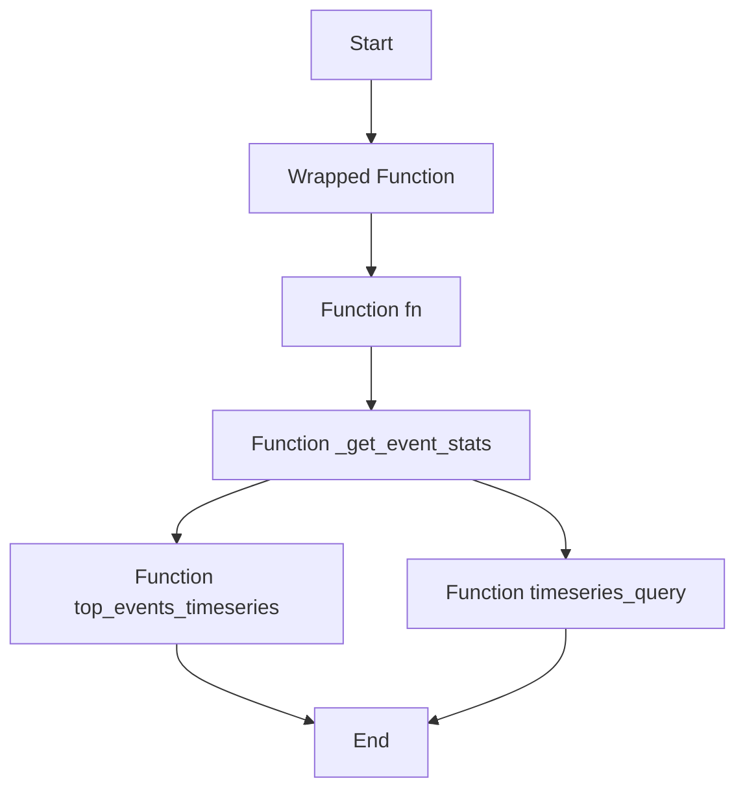

This document will cover the 'Wrapped' functionality in the Sentry application. We'll cover:

1. What is the 'Wrapped' functionality
2. How the 'Wrapped' functionality is used in the application
3. The flow of the 'Wrapped' functionality
4. The impact of the 'Wrapped' functionality on the end user.

Technical document: <SwmLink doc-title="Wrapped">[Wrapped](/.swm/understanding-the-wrapped-functionality.8e5csugw.sw.md)</SwmLink>

# What is the 'Wrapped' functionality

The 'Wrapped' functionality refers to a higher-order function that takes another function as an argument and returns a new function. This new function executes the original function only if certain conditions are met. If not, it returns `None`. This is a way of filtering operations based on their type.

# How the 'Wrapped' functionality is used in the application

The 'Wrapped' functionality is used in the Sentry application to filter operations based on their type. It takes another function as an argument and returns a new function that executes the original function only if the operation of the span is in the list of permitted operations. If not, it returns `None`. This is a way of filtering operations based on their type.

# The flow of the 'Wrapped' functionality

The flow of the 'Wrapped' functionality starts with the `get` function in the `organization_events_stats.py` file. This function is responsible for handling the request and organization parameters and returning a response. Depending on the number of top events, it either calls the `top_events_timeseries` or `timeseries_query` function from the `scoped_dataset`. The `top_events_timeseries` function performs a timeseries query for a limited number of top events and returns a dictionary of `SnubaTSResult` objects that have been zero-filled in case of gaps. The `timeseries_query` function performs arbitrary user timeseries queries against events and returns a `SnubaTSResult` object.

# The impact of the 'Wrapped' functionality on the end user

The 'Wrapped' functionality impacts the end user by filtering the operations based on their type. This ensures that the user only sees the operations that are relevant to them, improving the user experience.

&nbsp;

*This is an auto-generated document by Swimm AI 🌊 and has not yet been verified by a human*

<SwmMeta version="3.0.0" repo-id="Z2l0aHViJTNBJTNBc2VudHJ5LWRlbW8lM0ElM0FTd2ltbS1EZW1v" repo-name="sentry-demo" doc-type="product-flows">Powered by [Swimm](/)</SwmMeta>
