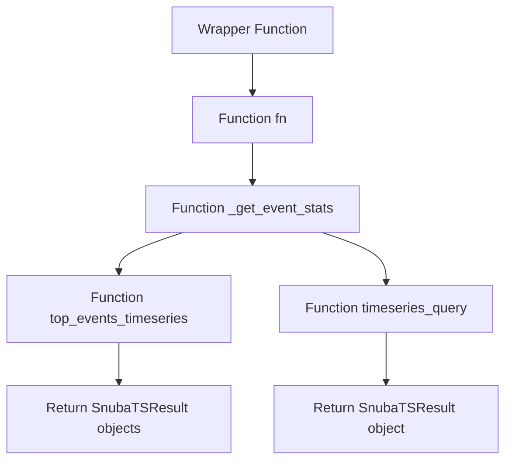

This document will cover the 'Wrapper Function' in the sentry-demo project. We'll cover:

1. What is the Wrapper Function
2. How the Wrapper Function works
3. The role of the Wrapper Function in fetching event statistics
4. The impact of the Wrapper Function on the end user.

Technical document: <SwmLink doc-title="Understanding the Wrapper Function">[Understanding the Wrapper Function](/.swm/understanding-the-wrapper-function.49z7c4xc.sw.md)</SwmLink>

# What is the Wrapper Function

The Wrapper Function is a higher-order function in the sentry-demo project. It takes another function as an argument and extends or alters the behavior of that function without explicitly modifying it. This function is used to add additional functionalities, modify behaviors, or handle inputs/outputs between functions.

# How the Wrapper Function works

The Wrapper Function works by taking in any function and its arguments, and executing it. It tracks the success of the function execution and increments a metric accordingly. If an exception occurs during the execution of the function, it increments a failure metric and rethrows the exception. This allows the system to monitor the performance of the function and handle any errors that may occur.

# The role of the Wrapper Function in fetching event statistics

The Wrapper Function plays a crucial role in fetching event statistics in the sentry-demo project. It is used to wrap around the function that performs the complex operation of fetching event statistics. This function, referred to as 'fn', takes in several parameters and depending on certain conditions, calls other functions with different arguments. The Wrapper Function allows the system to track the success of the 'fn' function and handle any exceptions that may occur during its execution.

# The impact of the Wrapper Function on the end user

From an end user's perspective, the Wrapper Function ensures that the system performs efficiently and reliably. By tracking the success of function executions and handling exceptions, it helps maintain the performance of the system. This results in a smoother and more reliable user experience. Additionally, by wrapping around the function that fetches event statistics, it plays a part in providing the end user with accurate and up-to-date event statistics.

&nbsp;

*This is an auto-generated document by Swimm AI 🌊 and has not yet been verified by a human*

<SwmMeta version="3.0.0" repo-id="Z2l0aHViJTNBJTNBc2VudHJ5LWRlbW8lM0ElM0FTd2ltbS1EZW1v" repo-name="sentry-demo" doc-type="product-flows">Powered by [Swimm](/)</SwmMeta>
