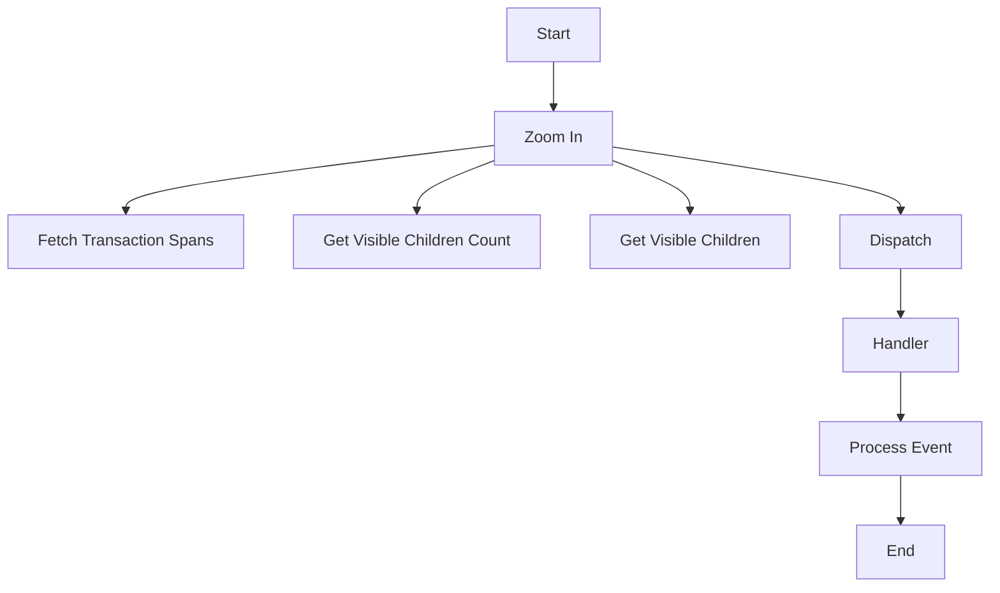

This document will cover the 'Zoom In' functionality in the Sentry application's performance monitoring capabilities. We'll cover:

1. The purpose of the 'Zoom In' function
2. The process of zooming into a specific node
3. The process of fetching transaction spans
4. The process of getting visible children of a node
5. The process of dispatching events
6. The process of handling events
7. The process of processing events.

Technical document: <SwmLink doc-title="Understanding the zoomIn Function">[Understanding the zoomIn Function](/.swm/understanding-the-zoomin-function.742o4gs8.sw.md)</SwmLink>

# Purpose of the 'Zoom In' Function

The 'Zoom In' function is a key part of the Sentry application's performance monitoring capabilities. It allows users to focus on specific nodes within a trace tree, enabling them to examine the performance of individual transactions in detail. This function is crucial for developers to identify performance bottlenecks and optimize their code.

# Process of Zooming into a Specific Node

When a user chooses to zoom into a specific node, the application first checks if the node is already zoomed in. If it is, the function ends and no further action is taken. If the node is not zoomed in, the application checks if the node is in the list of nodes. If it's not in the list, the function ends. If the node is in the list, the application gets the count of visible children of the node, removes them from the list, and sets the node's 'zoomedIn' property. If the node is expanded, it adds the visible children back to the list. If the node needs to be zoomed in, the application fetches the transaction spans and updates the node's 'fetchStatus' to 'loading'. Once the transaction spans are fetched, the node's 'fetchStatus' is updated to 'resolved', and the application updates the space of the tree and the trace root node.

# Process of Fetching Transaction Spans

To fetch the transaction spans, the application sends a request to the API with the necessary parameters. The API returns a promise that resolves to the transaction spans. These spans provide detailed information about the individual transactions within the node, allowing users to examine their performance.

# Process of Getting Visible Children of a Node

The application provides two functions to get information about the visible children of a node: 'getVisibleChildrenCount' and 'getVisibleChildren'. The 'getVisibleChildrenCount' function returns the count of visible children of the node, while the 'getVisibleChildren' function returns an array of the visible children. These functions are used to update the list of nodes when a user zooms into a specific node.

# Process of Dispatching Events

The 'dispatch' function is used to handle events within the application. It takes an event and arguments, and calls the handler for the event with the arguments. If there are no listeners for the event, the function returns early. This function is crucial for managing user interactions and updating the application state.

# Process of Handling Events

The 'handler' function is used to process events. It checks if the event is a canvas mutation event. If it is, and the event is synchronous, it processes the event synchronously. If the event is not a canvas mutation event, it only prunes the event. If the event is a canvas mutation event and is asynchronous, it processes the event asynchronously. This function ensures that the application responds correctly to user interactions and updates the state as necessary.

# Process of Processing Events

The 'processEvent' function is used to process canvas mutation events. It preloads the event, gets the source and target canvases, checks if the target canvas exists, mutates the target canvas, and updates the image element with the target canvas's data URL. It then prunes the event. This function is crucial for updating the visual representation of the trace tree when a user zooms into a specific node.

&nbsp;

*This is an auto-generated document by Swimm AI 🌊 and has not yet been verified by a human*

<SwmMeta version="3.0.0" repo-id="Z2l0aHViJTNBJTNBc2VudHJ5LWRlbW8lM0ElM0FTd2ltbS1EZW1v" repo-name="sentry-demo" doc-type="product-flows">Powered by [Swimm](/)</SwmMeta>
