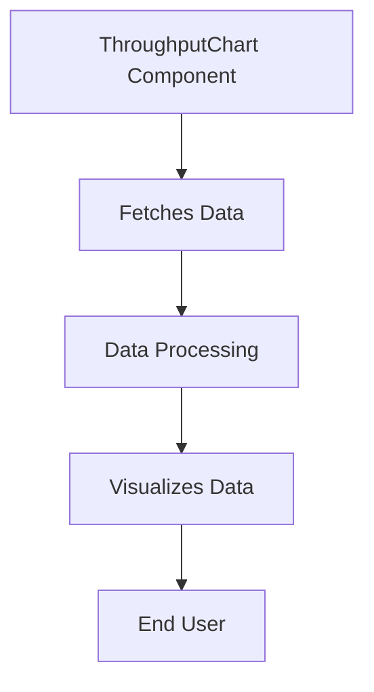

This document will provide a detailed understanding of the 'ThroughputChart' component in the Sentry application. We'll cover:

1. The purpose of the ThroughputChart component
2. How data is fetched for the chart
3. The flow of data from the API to the chart
4. The impact of this component on the end user.

Technical document: <SwmLink doc-title="Understanding the ThroughputChart Component">[Understanding the ThroughputChart Component](/.swm/understanding-the-throughputchart-component.h4clkugu.sw.md)</SwmLink>

# Purpose of the ThroughputChart Component

The ThroughputChart component is a visual representation of the throughput of published and processed data. It provides users with a clear and concise view of data flow, enabling them to understand the performance and efficiency of data processing and publishing.

# Fetching Data for the Chart

The data for the ThroughputChart is fetched using two hooks, 'usePublishQueuesTimeSeriesQuery' and 'useProcessQueuesTimeSeriesQuery'. These hooks fetch the time series data for the published and processed queues respectively. The fetched data is then used to populate the chart, providing the user with a visual representation of the throughput.

# Data Flow from API to Chart

The data flow begins with the 'usePublishQueuesTimeSeriesQuery' function, which constructs a search query and fetches the timeseries data. This data is then processed and used to create an 'eventView' object. The 'eventView' object is used to fetch additional data from the Discover API. The API payload is prepared and the API request is made. If the 'queryBatching' option is provided, the 'batchRequest' function is used to make the API request. Otherwise, the API request is made directly. The fetched data is then used to populate the ThroughputChart.

# Impact on the End User

The ThroughputChart component provides the end user with a visual representation of the throughput of published and processed data. This allows the user to understand the performance and efficiency of data processing and publishing. It can help users identify bottlenecks or inefficiencies in the data flow, and make informed decisions to improve performance.

&nbsp;

*This is an auto-generated document by Swimm AI 🌊 and has not yet been verified by a human*

<SwmMeta version="3.0.0" repo-id="Z2l0aHViJTNBJTNBc2VudHJ5LWRlbW8lM0ElM0FTd2ltbS1EZW1v" repo-name="sentry-demo" doc-type="product-flows">Powered by [Swimm](/)</SwmMeta>
