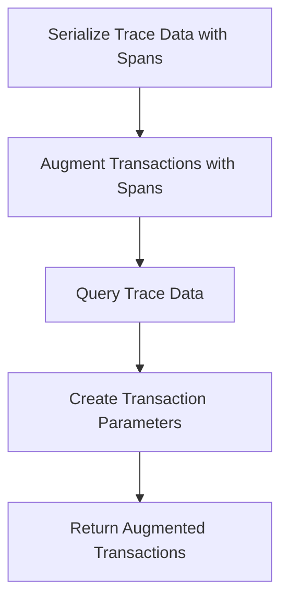

This document will cover the Trace Data Serialization and Augmentation feature of Sentry. We'll cover:

1. The process of serializing trace data with spans.
2. The augmentation of transactions with spans.
3. The querying of trace data.
4. The creation of transaction parameters.

Technical document: <SwmLink doc-title="Trace Data Serialization and Augmentation">[Trace Data Serialization and Augmentation](/.swm/trace-data-serialization-and-augmentation.58ex5wmz.sw.md)</SwmLink>

# Serialize Trace Data with Spans

The process begins with the serialization of trace data with spans. This involves processing a list of transactions and errors to create a serialized trace. Various operations such as creating a parent map, associating children, and sorting are performed during this process. The result is a dictionary containing the serialized transactions and orphan errors.

# Augment Transactions with Spans

The next step is to augment the transactions with parent, error, and problem data. This involves setting up the necessary data structures and then querying the parent span ids of segment spans and their corresponding transaction ids. The transactions, performance issues, and errors are then linked. The result is a list of augmented transactions.

# Query Trace Data

The trace data is then queried. This involves creating a transaction query and an error query based on the trace id, snuba parameters, transaction parameters, limit, and event id. These queries are then run in bulk and the results are processed. The result is the transformed results.

# Create Transaction Parameters

The final step is to create transaction parameters based on the trace id and snuba parameters. The metadata is queried and the start and end times of the transaction parameters are updated based on the min and max timestamps. The projects in the transaction parameters are also updated based on the project ids.

&nbsp;

*This is an auto-generated document by Swimm AI 🌊 and has not yet been verified by a human*

<SwmMeta version="3.0.0" repo-id="Z2l0aHViJTNBJTNBc2VudHJ5LWRlbW8lM0ElM0FTd2ltbS1EZW1v" repo-name="sentry-demo" doc-type="product-flows">Powered by [Swimm](/)</SwmMeta>
