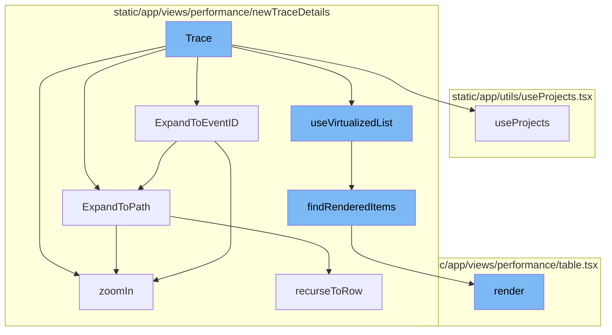

This document will cover the Trace Flow feature in Sentry, which includes:

1. Overview of Trace
2. Trace Flow
3. Expanding to Event ID
4. Expanding to Path
5. Zooming In
6. Using Projects
7. Using Virtualized List
8. Finding Rendered Items
9. Rendering the Table.

Technical document: <SwmLink doc-title="Understanding Trace Flow">[Understanding Trace Flow](/.swm/understanding-trace-flow.cf0pul6q.sw.md)</SwmLink>

# Overview of Trace

A Trace in Sentry represents a series of events, or tree of spans, that share a common root or parent. It provides a detailed snapshot of the sequence of operations that happen when handling a request. This is useful in understanding the flow of requests, dependencies, and the bottlenecks in a system.

# Trace Flow

The Trace function is the entry point of the trace flow. It sets up the necessary context and state for the trace view. This includes setting up theme, API, projects, organization, and trace state.

# Expanding to Event ID

The ExpandToEventID method is used to find a specific node in the trace tree based on its event ID. If the node is found, it expands the path to that node and fetches its children if necessary.

# Expanding to Path

The ExpandToPath method is used to expand a specific path in the trace tree. It traverses the tree based on the given path segments, expanding nodes and fetching their children as necessary.

# Zooming In

The zoomIn method is used to fetch more detailed information about a specific node in the trace tree. It fetches the transaction spans for the node and updates the node and tree accordingly.

# Using Projects

The useProjects function is a hook that provides projects from the ProjectsStore. It also provides a way to select specific project slugs, and search for more projects that may not be in the project store.

# Using Virtualized List

The useVirtualizedList function is a hook that provides a virtualized list of items. It optimizes rendering performance by only rendering the items that are currently visible in the viewport.

# Finding Rendered Items

The findRenderedItems function is used to find the items that should be rendered based on the current scroll position. It calculates the viewport and determines which items fall within it.

# Rendering the Table

The render method in the Table component is responsible for rendering the performance table. It fetches the necessary data and passes it to the GridEditable component for rendering.

&nbsp;

*This is an auto-generated document by Swimm AI 🌊 and has not yet been verified by a human*

<SwmMeta version="3.0.0" repo-id="Z2l0aHViJTNBJTNBc2VudHJ5LWRlbW8lM0ElM0FTd2ltbS1EZW1v" repo-name="sentry-demo" doc-type="product-flows">Powered by [Swimm](/)</SwmMeta>
